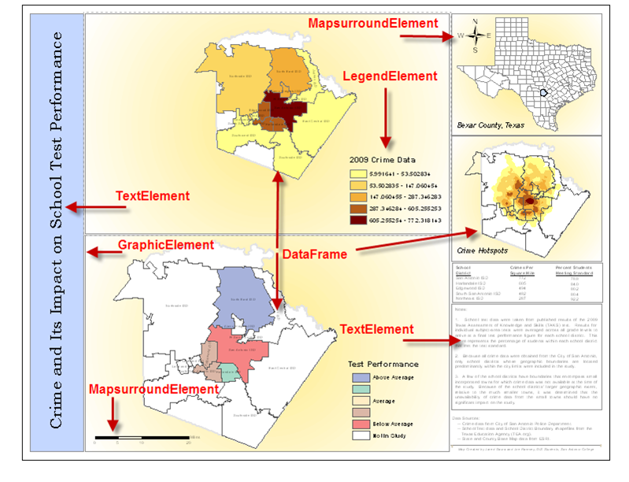
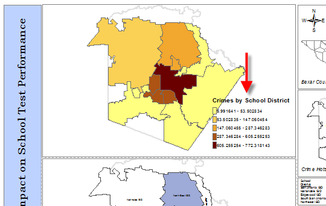

# Chapter 4: Automating Map Production and Printing

In this chapter, we will cover the following recipes:  
* Creating a list of layout elements  
* Assigning a unique name to layout elements  
* Restricting the layout elements returned by ListLayoutElements()  
* Updating the properties of layout elements  
* Getting a list of available printers  
* Printing maps with PrintMap()  
* Exporting a map to a PDF fie  
* Exporting a map to an image fie  
* Exporting a report  
* Building a map book with Data Driven Pages and ArcPy mapping  
* Publishing a map document to an ArcGIS Server service  

## 4.1 Introduction

The arcpy.mapping module, released with ArcGIS 10, provides a number of capabilities related to the automation of map production.  
The arcpy.mapping module can be used to automate map production, build map books, export maps to image or PDF files, and create and manage PDF files.  
In this chapter, you'll learn how to use the arcpy.mapping module to automate various geoprocessing tasks related to map production and printing.  
   


## 4.2 Creating a list of layout elements

Often, the first step in a geoprocessing script that automates the production of maps is to generate a list of the available layout elements.  
For example, you might need to update the title of your map before printing or creating a PDF file.  
In this case, the title is likely be stored in      a TextElement object.  
You can generate a list of TextElement objects in your map layout view and then change the title.  
The first step is to generate a list of TextElement objects.  


### 4.2.1 Getting ready

In ArcMap, two views are available, namely data view and layout view.  
Data view is used to view geographic and tabular data, analyze data, symbolize layers, and manage data without regard for any particular map page size or layout.  
Layout view shows the map as printed on a page, and is used to create production quality maps through the addition of map elements.  
These elements include map frames, layers, legends, titles, north arrows, scale bars, and title blocks.  
Each object in the layout is represented in arcpy.mapping as a layout element class.  
Examples of many of these layout element classes are displayed in the following screenshot:  
  




Each element can be assigned a unique name that can then be used to access the element programmatically.  
This unique name is defined in ArcMap.  
The arcpy.mapping module provides a ListLayoutElements() function that returns a list of all these elements.  
In this recipe, you will learn how to use the ListLayoutElements() function to generate a list of map layout elements.  
  


### 4.2.2 How to do it

Follow these steps to learn how to generate a list of layout elements:  
1.  Open C:\ArcpyBook\Ch4\Crime_Ch4.mxd in ArcMap.  
2.  Open the Python window.  
3.  Import the arcpy.mapping module:  
```py  
import arcpy.mapping as mapping  
```

4.  Reference the currently active document (Crime_Ch4.mxd) and assign this reference to a variable:  
```py  
mxd = mapping.MapDocument("CURRENT")  
```

5.  Generate a list of layout elements and print them to the screen if the name property is not empty:  
```py  
for el in mapping.ListLayoutElements(mxd): if el.name != '':
    print(el.name)  
```  

6.  The entire script should appear as follows:  
```py  
import arcpy.mapping as mapping  
mxd = mapping.MapDocument("CURRENT")  
for el in mapping.ListLayoutElements(mxd): if el.name != '':
    print(el.name)  
```  

7.  You can check your work by examining the c:\ArcpyBook\code\Ch4\CreateListLayoutElements.py solution file.  
  
8.  Run the script to see the following output:  
```py  
Crime_Inset Alternating Scale Bar  
Legend Test Performance Crime Legend  
North Arrow Inset_Map Test_Performance Crime  
```  


### 4.2.3 How it works

ListLayoutElements() returns a list of layout elements in the form of various layout classes.  
Each element can be one of the GraphicElement, LegendElement, PictureElement, TextElement, or MapSurroundElement object instances.  
Each element can have a unique name.  
You don't have to assign a name to each element, but it is helpful to do so if you plan to access these elements programmatically in your scripts.  
In this script, we first made sure that the element had a name assigned to it before printing the name.  
This was done because ArcMap does not require that an element be assigned a name.  


## 4.3 Assigning a unique name to layout elements

It's a good practice to assign a unique name to all your layout elements using ArcMap.  
This is important in the event that your geoprocessing scripts need to access a particular element to make changes.  
For example, you might need to update the icon that displays your corporate logo.  
Rather than making this change manually in all your map document files, you could write a geoprocessing script that updates all your map document files programmatically with the new logo.  
However, in order for this to be possible, a unique name will need to be assigned to your layout elements.  
This gives you the ability to access the elements of your layout individually.  


### 4.3.1 Getting ready

As I mentioned in the previous recipe, each layout element will be one of a number of element types and each can be assigned a name.  
This element name can then be used when you need to reference a particular element in your Python script.  
You can use ArcMap to assign unique names to each layout element.  
In this recipe, you will use ArcMap to assign names to the elements.  


### 4.3.2 How to do it

Follow these steps to learn how to assign unique names to each layout element using ArcMap:  
  
1.  Open C:\ArcpyBook\Ch4\Crime_Ch4.mxd in ArcMap.  
   
2.  Switch to the layout view and you should see something similar to this screenshot:  
  
3.  Names are assigned differently depending on the element type.  
Click on the uppermost data frame, which should be Crime, to select it. The selection handles should appear as follows:  
  
4.  Right-click on the upper data frame and select Properties to display the Data Frame Properties window, as shown in the following screenshot.  
The Element Name property is what defines the unique name for the element and is found on the Size and Position tab as seen in the following screenshot.  
In this case, set the element name to Crime:  
  
5.  Close the Data Frame Properties window.  
  
6.  Select 2009 Crime Data legend and open the Properties window by right-clicking on the legend and selecting Properties.  
  
7.  Click on the Size and Position tab.  
  
8.  Change the Element Name value to Crime Legend, as shown in the following screenshot:  
  
9.  You can also define unique names for text elements.  
Select the title element (Crime and Its Impact on School Test Performance), right-click on the element, and select Properties.  
  
10. Select the Size and Position tab and define a unique name for this element, as shown in the following screenshot:  


### 4.3.3 How it works

Each element in the layout view can be assigned a name, which can then be used in your geoprocessing script to retrieve the specific element.  
You should strive to define unique names for each element.  
It isn't required that you define a unique name for each element, nor is it required that you even define a name at all.  
However, it is a best practice to give each element a name and ensure that each name is unique if you intend to access these elements from your Python scripts.  
In terms of naming practices for your elements, you should strive to include only letters and underscores in the name.  


### 4.3.4 There's more

You can use element names in conjunction with the ListLayoutElements() function  to restrict the elements that are returned by the function through the use of a wildcard parameter.  
In the next recipe, you'll learn how to restrict the list of layout elements that are returned through the use of wildcards and element types.  


## 4.4 Restricting the layout elements returned by ListLayoutElements()

Layouts can contain a large number of elements, many of which you won't need for a particular geoprocessing script.  
The ListLayoutElements() function can restrict the layout elements returned, by passing a parameter that defies the type of element that should be returned along with an optional wildcard, which fids elements using a portion of the name.  


### 4.4.1 Get ready


There are many different types of layout elements, including graphics, legends, pictures, text, and data frames.  
When you return a list of layout elements, you can restrict (fiter) the types of elements that are returned.  
In this recipe, you will write a script that fiters the layout elements returned by element type and wildcard.  

### 4.4.2 How to do it

1. Open __```C:\ArcpyBook\Ch4\Crime_Ch4.mxd```__ in ArcMap.  
2. Open the Python window.  
3. Import the arcpy.mapping module: import arcpy.mapping as mapping  
4. Reference the currently active document (Crime_Ch4.mxd) and assign this reference to a variable: __```mxd = mapping.MapDocument("CURRENT")```__  
5. Use the ListLayoutElements()  function with a restriction of only legend elements, as well as a wildcard that returns elements with a name containing the Crime text anywhere in the name:  
```py  
for el in mapping.ListLayoutElements(mxd, "LEGEND_ ELEMENT", "*Crime*"):
    print(el.name)  
```  
6. You can check your work by examining the c:\ArcpyBook\code\Ch4\ RestrictLayoutElements.py solution fie.  
7. Run the script. In this case, only a single layout element will be returned: Crime Legend  


### 4.4.3 How it works

ListLayoutElements()  is a versatile function, which in its most basic form is used to return a list of all the layout elements on the page layout of a map document.  
However, there are two optional parameters that you can supply to fiter this list.  
The fist type of fiter is an element type fiter in which you specify that you only want to return one of the layout element types.  
You can also apply a wildcard to fiter the returned list.  
These two types of fiters can be used in combination.  
For example, in this recipe, we are specifying that we only want to return LEGEND_ELEMENT objects with the Crime text anywhere in the element name.  
This results in a highly fitered list that only contains a single layout element.  


> ListLayoutElements()  can be fitered using one of these element types: __DATAFRAME_ELEMENT, GRAPHIC_ELEMENT, LEGEND_ELEMENT, MAPSURROUND_ELEMENT, PICTURE_ ELEMENT, or TEXT_ELEMENT.__  

## 4.5 Updating the properties of layout elements

Each layout element has a set of properties that you can update programmatically.  
For example, LegendElement includes properties that allow you to change the position of the legend on the page, update the legend title, and access legend items.  

### 4.5.1 Getting ready  

__There are many different types of layout elements__, including __graphics, legends, text, maps, and pictures__.  
Each of these elements is represented by a class in the arcpy.mapping package.  
These classes provide various properties that you can use to programmatically alter the element.  
  

The __DataFrame class__ provides access to the data frame properties in the map document fie.  
This object can work with both map units and page layout units, depending on the property being used.  
Page layout properties, such as positioning and sizing, can be applied to the properties, including elementPositionX, elementPositionY, elementWidth, and elementHeight.  


The __GraphicElement object__ is a generic object for various graphics that can be added to the page layout, including tables, graphs, neatlines, markers, lines, and area shapes.  
You'll want to make sure that you set the name property for each graphic element (and any other element for that matter), if you intend to access it through a Python script.  
  

__ provides operations__ to position the legend on the page layout, modifiation of the legend title, and also provides access to the legend items and the parent data frame.  
__LegendElement can only be associated with a single data frame.__  

__MapSurroundElement__ can refer to north arrows, scale bars, and scale text.  
It is similar to LegendElement and is associated with a single data frame.  
Properties on this object enable repositioning of the element on the page.  
  
__PictureElement__ represents a raster or image on the page layout.  
The most useful property of this object enables acquiring and setting the data sources, which can be extremely helpful when you need to change a picture, such as a logo, in multiple map documents.  
For example, you could write a script that iterates through all your map document fies and replaces the current logo with a new logo.  
You can also reposition or resize the object.  
  
__TextElement__ represents text on a page layout, including inserted text, callouts, rectangle text, and titles, but does not include legend titles or texts that are part of a table or chart.  
Properties enable the modifiation of a text string, which can be extremely useful in situations where you need to make the same text string change in multiple places in the page layout or over multiple map documents, and of course, repositioning of the object is also available.  
  
Each element in the page layout is returned as an instance of one of the element objects.  
In this recipe, we're going to use the title property of the Legend object to programmatically change the title of the Crime legend and obtain a list of the layers that are part of the legend.  


### 4.5.2 How to do it 

Follow these steps to learn how to update the properties of a layout element:  
1. Open C:\ArcpyBook\Ch4\Crime_Ch4.mxd in ArcMap.  
2. Open the Python window.  
3. Import the arcpy.mapping module:  
```  
import arcpy.mapping as mapping  
```  
4. Reference the currently active document (Crime_Ch4.mxd), and assign this reference to a variable:  
```  
mxd = mapping.MapDocument("CURRENT")  
```  
5. Use the ListLayoutElements() method with a wildcard and restriction of only legend elements to return only the Crime legend and store it in a variable:  
```  
elLeg = mapping.ListLayoutElements(mxd, "LEGEND_ELEMENT","*Crime*")[0]  
```  
6. Use the title property to update the title of the legend:  
```  
elLeg.title = "Crimes by School District"  
```  
7. Get a list of the layers that are a part of the legend and print the names:  
```  
for item in elLeg.listLegendItemLayers():  
print(item.name)  
```  
8. The entire script should appear as follows:  
```  
import arcpy.mapping as mapping  
mxd = mapping.MapDocument("CURRENT")  
elLeg = mapping.ListLayoutElements(mxd, "LEGEND_ELEMENT","*Crime*")[0]  
elLeg.title = "Crimes by School District"  
for item in elLeg.listLegendItemLayers():
    print(item.name)  
```  
9. You can check your work by examining the c:\ArcpyBook\code\Ch4\UpdateLayoutElementProperties.py solution file.  
  
10. Run the script. You should see the following layers printed:  
```  
Burglaries in 2009  
Crime Density by School District  
```  
11. The change is displayed in the following screenshot:  
  
  



## 4.6 Getting a list of available printers  

Yet another list function provided by arcpy is ListPrinterNames(), which generates a list of the available printers.  
As is the case with the other list functions that we've examined, ListPrinterNames() is often called a preliminary step in a multistep script.  
  


### 4.6.1 Getting ready

Before printing maps with the PrintMap() function, it is a common practice to call the ListPrinterNames() function, which returns a list of the available printers for the local computer.  
A particular printer can then be found by iterating the list of printers and using it as an input for the PrintMap() function.  
  


### 4.6.2 How to do it

Follow these steps to learn how to use the ListPrinterNames() function to return a list of the available printers for your script:  
  
1.  Open C:\ArcpyBook\Ch4\Crime_Ch4.mxd in ArcMap.  
  
2.  Open the Python window.  
  
3.  Import the arcpy.mapping module:  
```py  
import arcpy.mapping as mapping  
```  
  
4.  Reference the currently active document (Crime_Ch4.mxd) and assign this reference to a variable:  
```py  
mxd = mapping.MapDocument("CURRENT")  
```  
  
5.  Call the ListPrinterNames() function and print each printer:  
```py  
for printerName in mapping.ListPrinterNames(): print(printerName)  
```  
  
6.  You can check your work by examining the c:\ArcpyBook\code\Ch4\ GetListOfPrinters.py solution file.  
  
7.  Run the script. The output will vary depending upon the list of available printers for your computer. However, it should print something similar to the following code snippet:  
```py  
HP Photosmart D110 series  
HP Deskjet 3050 J610 series (Network) HP Deskjet 3050 J610 series (Copy 1) HP Deskjet 3050 J610 series  
Dell 968 AIO Printer  
```  


### 4.6.3 How it works

The ListPrinterNames() function returns a Python list containing all the printers available to use in your script.  
You can then use the PrintMap() function, which we'll examine in the next recipe, to send a print job to a particular printer that is available for your computer.  
 


## 4.7 Printing maps with PrintMap()  

Sending your map layout to a printer is easy with the PrintMap() function.  
By default, the print job will be sent to the default printer saved with the map document, but you can also define a specific printer to which the job should be sent.  


### 4.7.1 Getting ready

The arcpy.mapping module provides a PrintMap() function to print page layouts or data frames from ArcMap.  
Before calling PrintMap(), it is a common practice to call the ListPrinterNames() function, which returns a list of the available printers for the local computer.  
A particular printer can then be found by iterating the list of printers that can be used as an input for the PrintMap() function.  
__PrintMap() can print either a specific data frame or the page layout of a map document.__  
By default, this function will use the printer saved with the map document or, the default system printer in the map document.  
As I mentioned earlier, you can also use ListPrinterNames() to get a list of the available printers, and select one of these printers as an input for PrintMap().  
In this recipe, you will learn how to use the PrintMap() function to print the layout.  


### 4.7.2 How to do it

Follow these steps to learn how to use the PrintMap() function to print the layout view in ArcMap:  
  
1. Open C:\ArcpyBook\Ch4\Crime_Ch4.mxd in ArcMap.  
  
2. Open the Python window.  
  
3. Import the arcpy.mapping module:  
```py  
import arcpy.mapping as mapping  
```  
  
4.  Reference the currently active document (Crime_Ch4.mxd), and assign this reference to a variable:  
```py  
mxd = mapping.MapDocument("CURRENT")  
```  
  
5.  Look for the Test_Performance data frame and print it if it's found:  
```py  
for df in mapping.ListDataFrames(mxd): if df.name == "Test_Performance":  
    mapping.PrintMap(mxd,"",df)  
```  
  
6.  You can check your work by examining the c:\ArcpyBook\code\Ch4\ PrintingWithPrintMap.py solution file.  
  
7.  Run the script. The script should send the data frame to the default printer.  
  


### 4.7.3 How it works

The __PrintMap()__ function accepts one required parameter and a handful of optional parameters.  
The required parameter is a reference to the map document.  
__The first optional parameter is the printer name.__  
In this case, we haven't specified a particular printer to use.  
Since we haven't provided a specific printer; it will use the printer saved with the map document or the default system printer if a printer is not part of the map document.  
The second optional parameter is the data frame that we'd like to print, which in this instance is Test_Performance.  
Other optional parameters, not supplied in this case, are an output print file and image quality.  


## 4.8 Exporting a map to a PDF file  

Rather than sending your map or layout view to a printer, you may want to simply create PDF files that can be shared.  
ArcPy mapping provides an ExportToPDF() function, which you can use to do this.  
  


### 4.8.1 Getting ready

PDF is a very popular interchange format designed to be viewable and printable from many different platforms.  
The ArcPy mapping ExportToPDF() function can be used to export data frames or the page layout to a PDF format.  
By default, the ExportToPDF() function exports the page layout, but you can pass an optional parameter that references a particular data frame, which can be printed instead of the page layout.  
In this recipe, you will learn how to export the page layout as well as a specific data frame to a PDF file.  


### 4.8.2 How to do it

Follow these steps to learn how to export a map to a PDF file:  
  
1.  Open C:\ArcpyBook\Ch4\Crime_Ch4.mxd in ArcMap.  
  
2.  Open the Python window.  
  
3.  Import the arcpy.mapping module:  
```py  
import arcpy.mapping as mapping  
```  
  
4.  Reference the currently active document (Crime_Ch4.mxd), and assign this reference to a variable:  
```py  
mxd = mapping.MapDocument('CURRENT')  
```  
  
5.  Export the page layout with the ExportToPDF() function:  
```py  
mapping.ExportToPDF(mxd,r"c:\ArcpyBook\Ch4\Map_PageLayout.pdf")  
```  
  
6.  You can check your work by examining the c:\ArcpyBook\code\Ch4\ ExportToPDF_Step1.py solution file.  
  
7.  Run the script.  
  
8.  Open the Map_PageLayout.pdf file that was created, and you should see something similar to the following screenshot:  
  
9.  Now, we'll print a specific data frame from our map document file.  
Alter your script, so that it appears as follows.  
You can check your work by examining the c:\ArcpyBook\code\Ch4\ExportToPDF_Step2.py solution file.  
  
10. Run the script and examine the output of the PDF file.  
  
  
   
  


### 4.8.3 How it works

The ExportToPDF() function requires two parameters, including a reference to the map document and the file that serves as the output PDF file.  
The first script that we developed was passed in a reference to the map document along with an output PDF file.  
Since we didn't pass in an optional parameter specifying the data frame, the ExportToPDF() function will export the page layout.  
There are also many optional parameters that can be passed into this method, including a specific data frame and a number of parameters mostly related to the quality of the output content and file.  
Our second script is passed in a specific data frame that should be exported.  
You can refer to the ArcGIS help pages for more information about each of the optional parameters.  


## 4.9 Exporting a map to an image file  

You can also export the contents of the map or layout view to an image file by using one of  the many functions provided by arcpy.mapping.  
Each image export function will differ in its name depending upon the type of image file you'd like to create.  
The parameters passed into the function will also vary slightly.  


### 4.9.1 Getting ready

In addition to providing the ability to export data frames and the page layout to a PDF format, you can also use one of the many export functions provided by arcpy.mapping to export  an image file.  
Some of the available formats include AI, BMP, EMF, EPS, GIF, JPEG, SVG, and TIFF.  
The parameters provided for each function will vary depending on the type of image.  
Some examples of these function names include ExportToJPEG(), ExportToGIF(), and ExportToBMP().  
In this recipe, you'll learn how to export your maps to images.  


### 4.9.2 How to do it

Follow these steps to learn how to export your data or layout view to an image file:  
  
1.  Open C:\ArcpyBook\Ch4\Crime_Ch4.mxd in ArcMap.  
  
2.  Open the Python window.  
  
3.  Import the arcpy.mapping module:  
```py  
import arcpy.mapping as mapping  
```

4.  Reference the currently active document (Crime_Ch4.mxd), and assign this reference to a variable:  
```py  
mxd = mapping.MapDocument("CURRENT")  
```

5.  Get a list of data frames in the map document and find the data frame with the name "Crime".  
```py  
for df in mapping.ListDataFrames(mxd): if df.name == "Crime":  
```

6.  Export the Crime data frame as a JPEG image.  
Your entire script should now appear as follows:  
  
7.  You can check your work by examining the c:\ArcpyBook\code\Ch4\ ExportMapImageFile.py solution file.  

8.  Run the script and examine the output file.  


### 4.9.3 How it works

Note that the ExportToJPEG() function looks virtually the same as ExportToPDF().  
Keep in mind though that the optional parameters will be different for all the export functions.  
Each ExportTo<Type> function will vary depending on the parameters that can be used in the creation of the image file.  


## 4.10 Exporting a report  

Reports in ArcGIS provide you with a way of presenting information about your data or analysis.  
Information in a report is displayed by using information pulled directly from an attribute table in a feature class or a standalone table.  
Reports can contain attribute information, maps, pictures, graphics, and other supporting information.  
ArcMap includes a Report Wizard and Report Designer that you can use to create and modify reports.  
You can also save the format of a report to a template file.  
This template file can be used repeatedly to generate new reports based on any changes in your data.  
Using a combination of a report template along with arcpy.mapping, you can automate the production of reports.  


### 4.10.1 Getting ready

The Report Wizard in ArcGIS can be used to create reports.  
There are two native data formats for ArcGIS reports: Report Document File (RDF) and Report Layout File (RLF).  
RDF reports provide a static report of your data.  
A one-time snapshot, if you will.  
A RLF is a template file and is created using Report Designer.  
The report template file can be used repeatedly and includes all the fields in the report along with how they are grouped, sorted, and formatted.  
It also includes any layout elements, such as graphics or maps.  
When the report is rerun, the report regenerates based on the source data that is connected to the template.  
The arcpy.mapping ExportReport() function can be used to connect a data source to a template file to automate the creation of a report.  
In this recipe, you will learn how to use the ExportReport() function with the PDFDocument class to create a report that contains crime information for school districts.  
The report will include attribute information and a map of the boundaries of the school district.  


### 4.10.2 How to do it

To save some time on this recipe, I have precreated a report template (RLF) file for you to use.  
This file, called CrimeReport.rlf, is located in the c:\ArcpyBook\Ch4 folder and contains attribute columns for the name of the school district, number of crimes, crime density, and test performance scores.  
In addition to this, a placeholder for a map containing the boundaries of the school district has also been added to the template.  
  
Follow these steps to learn how to automate the production of reports using the arcpy.  
mapping ExportReport() function and the PDFDocument class:  
  
1.  Create a new script file in IDLE or your favorite Python editor and save it as c:\ ArcpyBook\Ch4\CreateReport.py.  
  
2.  Import the arcpy and os modules and get the current working directory:  
```py  
import arcpy import os  
path = os.getcwd()  
```  
  
3.  Create the output PDF file:  
```py  
#Create PDF and remove if it already exists pdfPath = path + r"\CrimeReport.pdf"  
if os.path.exists(pdfPath): os.remove(pdfPath)  
pdfDoc = arcpy.mapping.PDFDocumentCreate(pdfPath)  
```  
  
4.  Create a list of school districts. We'll loop through this list to create reports for each district:  
```py  
districtList = ["Harlandale", "East Central", "Edgewood", "Alamo Heights", "South San Antonio", "Southside", "Ft Sam Houston",  
"North East", "Northside", "Lackland", "Southwest", "Judson", "San Antonio"]  
```  
  
5.  Get references to the map document, data frame, and layer:  
```py  
mxd = arcpy.mapping.MapDocument(path + r"\Crime_Ch4.mxd")   
df = arcpy.mapping.ListDataFrames(mxd)[0]  
lyr = arcpy.mapping.ListLayers(mxd, "Crime Density by School District")[0]  
```  
  
6.  Start a loop through the school districts and apply a where clause that acts as the  
definition query so that only the individual school district will be displayed:  
```py  
pageCount = 1  
for district in districtList:  
#Generate image for each district  
whereClause = "\"NAME\" = '" + district + " ISD'" lyr.definitionQuery = whereClause  
```  
  
7.  Select the individual school district, set the data frame extent to the extent of the school district, and clear the selection set:  
```py  
arcpy.SelectLayerByAttribute_management(lyr, "NEW_SELECTION", whereClause)  
df.extent = lyr.getSelectedExtent() arcpy.SelectLayerByAttribute_management(lyr, "CLEAR_SELECTION")  
```  
  
8.  Export the data frame to a bitmap (.bmp) file:  
```py  
arcpy.mapping.ExportToBMP(mxd, path + "\DistrictPicture.bmp", df) #single file  
```  
  
9.  Call the ExportReport() function to create the report:  
```py
#Generate report  
print("Generating report for: " + district + " ISD")    
arcpy.mapping.ExportReport(report_source=lyr, report_layout_file=path +  
r"\CrimeLayout.rlf",output_file=path + r"\temp" + str(pageCount) + ".pdf", starting_page_number=pageCount)  
```
  
10. Append the report to the PDF file:  
```py  
#Append pages into final output print("Appending page: " + str(pageCount))  
pdfDoc.appendPages(path + r"\temp" + str(pageCount) + ".pdf")  
```  
  
11. Remove the temporary PDF report:  
```py  
os.remove(path + r"\temp" + str(pageCount) + ".pdf") pageCount = pageCount + 1  
```  
  
12. Save the PDF document:  
```py  
pdfDoc.saveAndClose()  
```  
  
13. The entire script should appear as follows:  
  
14. You can check your work by examining the c:\ArcpyBook\code\Ch4\ CreateReport.py solution file.  
  
15. Save and run your script.  
This will create a file called CrimeReport.pdf in your c:\ArcpyBook\ch4 folder.  
The contents will contain one report page for each school district, as seen in this screenshot:  
   
  


### 4.10.3 How it works

In this recipe, we used several functions and classes that are part of the arcpy.mapping module, including PDFDocument, ExportToReport() and ExportToBMP().  
Initially, we used the PDFDocumentCreate() function to create an instance of PDFDocument, which holds a pointer to the CrimeReport.pdf file that we'll create.  
Next, we created a list of school districts and began a loop through each of them.  
Inside the loop, for each district, we set a definition query on the layer, selected the district, and returned the extent of the district that was used to set the extent of the data frame.  
A bitmap file was then created using the ExportToBMP() function and the report was generated with the ExportReport() function.  
Finally, each page was appended to the CrimeReport.pdf file and the document was saved.  


## 4.11 Building a map book with Data Driven Pages and ArcPy mapping  

Many organizations have a need to create map books containing a series of individual maps that cover a larger geographical area.  
These map books contain a series of maps and some optional and additional pages, including title pages, an overview map, and some other ancillary information, such as reports and tables.  
For example, a utility company might want   to generate a map book detailing their assets across a service area.  
A map book for this utility company could include a series of maps, each at a large scale, along with a title page and an overview map.  
These resources would then be joined together into a single document that could be printed or distributed as a PDF file.  


### 4.11.1 Getting ready

ArcGIS for Desktop provides the ability to efficiently create a map book through a combination of Data Driven Pages along with an arcpy.mapping script.  
With a single map document  file, you can use the Data Driven Pages toolbar to create a basic series of maps using the layout view along with your operational data and an index layer.  
The index layer contains features that will be used to define the extent of each map in the series.  
However, if you need to include additional pages in the map book, including a title page, an overview map, and other ancillary pages, you'll need to combine the output from the Data Driven Pages toolbar with the functionality provided by the arcpy.mapping module.  
With the arcpy.mapping module, you can automate the export of the map series and append the ancillary files to a single map book document.  
While it is certainly possible to programmatically generate the entire map book using only Python and the arcpy.mapping module, it is more efficient to use a combination of programming and the Data Driven Pages toolbar.  
In this recipe, you'll learn how to create a map book that includes a series of maps along with a title page and an overview map page.  
  
  


### 4.11.2 How to do it

To save some time on this recipe, I have precreated a map document file for you that contains the data and Data Driven Pages functionality to create a series of topographic maps for King County, Washington.  
This map document file, called Topographic.mxd, can be found in the c:\ArcpyBook\Ch4 folder.  
You may want to take a few moments to open this file in ArcGIS for Desktop and examine the data.  
The Data Driven Pages functionality has already been enabled for you.  
Additionally, a map title page (TitlePage.pdf) and an overview map page (MapIndex.pdf) have also been created for you.  
These files are also located in your c:\ArcpyBook\Ch4 folder.  
The steps to generate a map series can be somewhat lengthy, and are beyond the scope of this book.  
However, if you'd like an overview of the process, go to the ArcGIS Desktop Help system, navigate to Desktop | Mapping | Page layouts | Creating a Map Book, and follow the first seven items under this folder.  
This includes building map books with ArcGIS through adding dynamic text to your map book.  
  
Follow these steps to learn how to use the Data Driven Pages functionality and the arcpy. mapping module to create a map book:  
  
1.  Create a new IDLE script and save it as c:\ArcpyBook\Ch4\DataDrivenPages_ MapBook.py.  
  
2.  Import the arcpy and os modules:  
```py  
import arcpy import os  
```  
3.  Create an output directory variable:  
```py  
# Create an output directory variable outDir = r"C:\ArcpyBook\Ch4"  
```

4.  Create a new, empty PDF document in the specified output directory:  
```py  
# Create a new, empty pdf document in the specified output directory  
finalpdf_filename = outDir + r"\MapBook.pdf" if os.path.exists(finalpdf_filename):  
os.remove(finalpdf_filename) finalPdf =  
arcpy.mapping.PDFDocumentCreate(finalpdf_filename)  
```

5.  Add the title page to the PDF:  
```py  
# Add the title page to the pdf print("Adding the title page  \n")  
finalPdf.appendPages(outDir + r"\TitlePage.pdf")  
```

6.  Add the index map to the PDF:  
```py  
# Add the index map to the pdf print("Adding the index page \n")  
finalPdf.appendPages(outDir + r"\MapIndex.pdf")  
```

7.  Export the Data Driven Pages to a temporary PDF and then add it to the final PDF:  
```py  
# Export the Data Driven Pages to a temporary pdf and then add it to the  
# final pdf. Alternately, if your Data Driven Pages have already been  
# exported, simply append that document to the final pdf. mxdPath = outDir + r"\Topographic.mxd"  
mxd = arcpy.mapping.MapDocument(mxdPath) print("Creating the data driven pages \n") ddp = mxd.dataDrivenPages  
temp_filename = outDir + r"\tempDDP.pdf"  
if os.path.exists(temp_filename): 
        os.remove(temp_filename)  
ddp.exportToPDF(temp_filename, "ALL") 
print("Appending the map series \n") 
finalPdf.appendPages(temp_filename)  
```

8.  Update the properties of the final PDF:  
```py  
# Update the properties of the final pdf. 
finalPdf.updateDocProperties(pdf_open_view="USE_THUMBS", pdf_layout="SINGLE_PAGE")  
```

9.  Save the PDF:  
```py  
# Save your result 
finalPdf.saveAndClose()  
```

10. Remove the temporary Data Driven Pages file:  
```py  
# remove the temporary data driven pages file 
if os.path.exists(temp_filename):          
        os.remove(temp_filename)  
```

11. The entire script should appear as follows:  
  
12. You can check your work by examining the C:\ArcpyBook\code\Ch4\DataDrivenPages_MapBook.py solution file.  
  
13. Save and execute your script.  
If the script successfully executes, you should find a new file called MapBook.pdf in the c:\ArcpyBook\Ch4 folder.  
When you open this file, you should see this screenshot:  
  
  


### 4.11.3 How it works

The PDFDocument class in the arcpy.mapping module is frequently used to create map books.  
In this recipe, we used the PDFDocumentCreate() function to create an instance of PDFDocument.  
A path to the output PDF file was passed into the PDFDocumentCreate() function.  
With this instance of PDFDocument, we then called the PDFDocument.  
appendPages() method twice, inserting the title page and map index files that already existed as PDF files.  
Next, we retrieved a dataDrivenPages object from the map document file and exported each of the pages to a single PDF document.  
This document was then appended to our final output PDF file that already contained the title page and map index page.  
Finally, we updated the PDFDocument properties to use thumbs and a single page view, saved the entire file, and removed the temporary data drive page document.  
   


## 4.12 Publishing a map document to an ArcGIS Server service  

Using the arcpy.mapping module, it is possible to publish your map document files to ArcGIS Server as map services.  
ArcGIS Server is a platform to distribute maps and data on the Web.  
Using the ArcGIS JavaScript API, web and mobile applications can be created from services created in ArcGIS Server.  
For more information about ArcGIS Server, please visit the esri ArcGIS Server site at http://www.esri.com/software/arcgis/arcgisserver.  
There are several steps involved in creating a map service from a map document file.  
The map document file must first be analyzed for suitability and performance issues and any resulting errors must be fixed before final publication to ArcGIS Server.  
This process involves several steps including a call to an arcpy.mapping function along with the use of a couple of tools  in ArcToolbox that can be called from your script.  
After errors have been fixed, you can then upload the resulting Service Definition Draft file to ArcGIS Server as a service.  


```python

```
