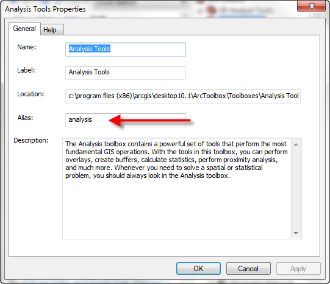

# Chapter 5: Executing Geoprocessing Tools from Scripts

In this chapter, we will cover the following recipes:  
  
* Finding geoprocessing tools  
* Retrieving a toolbox alias  
* Executing geoprocessing tools from a script  
* Using the output of a tool as an input to another tool  


## 5.1 Introduction

ArcGIS for Desktop contains over 800 geoprocessing tools, which can be used in your Python scripts.  
Using geoprocessing tools from your Pythons scripts enables you to execute complex workflows and perform batch geoprocessing tasks.  
In this chapter, you will learn how to use these tools in your scripts.  
Each tool has unique characteristics.  
The syntax to execute each will differ depending upon the type of input required to successfully execute the tool.  
We'll examine how you can determine the input parameters for any tool by using the ArcGIS for Desktop help system.  
The execution of a tool results in the creation of one or more output datasets along with a set of messages that are generated while the tool is running.  
We'll examine how you can use these messages.  
   


## 5.2 Finding geoprocessing tools

Before using a tool in your geoprocessing script, you will need to make sure that you have access to this tool, based on the current license level of ArcGIS for Desktop that you are running or that your end users will run.  
In addition to this, any extensions you have licensed and enabled must be taken into consideration as well.  
This information is contained within the ArcGIS for Desktop help system.  


### 5.2.1 Getting ready

The availability of geoprocessing tools for your script is dependent on the level of the ArcGIS license you are using.   
In version 10.3 of ArcGIS for Desktop, there are three license levels, namely basic, standard, and advanced.   
These were formerly known as ArcView, ArcEditor,  and ArcInfo, respectively.   
It is important for you to understand the license level required for the tool that you want to use in your script.   
In addition to this, the use of extensions in ArcGIS for Desktop can result in the availability of additional tools for your script.   
There are two primary ways to find tools in ArcGIS for Desktop.   
The first is to use the search window and the second is to simply browse the contents of ArcToolbox.   
In this recipe, you will learn how to use the search window to find available geoprocessing tools that can be used in your scripts.   


### 5.2.2 How to do it

1.  Open C:\ArcpyBook\Ch5\Crime_Ch5.mxd in ArcMap.  
  
2.  From the Geoprocessing menu item, select Search For Tools.  
This will display the Search window, as shown in the following screenshot.  
By default, you will be searching for Tools:  
  
3.  Type the Clip term into the search textbox.  
As you begin typing this word, the search textbox will automatically filter the results based on the first few letters you type.  
You'll notice that for Clip, there are three possible tools: clip(analysis), clip(coverage), and clip(data_management).  
There are a number of cases where there are several geoprocessing tools with the same name.  
To uniquely define a tool, the toolbox alias is attached to the tool name.  
We'll examine toolbox aliases in greater detail in the next recipe.  
  
4.  For now, click on the search button to generate a list of matching tools.  
The search should generate a list similar to what you see in the following screenshot.  
Tools are indicated by a hammer icon in the search results.  
You'll also see a couple of other icons in the search results.  
The scroll icon indicates a Python script, and an icon containing multicolored squares indicates a model:  
  
5.  Select the Clip (Analysis) tool.  
This will open the dialog box for the Clip (Analysis) tool.  
This isn't all that useful to you as a script programmer.  
You will probably be more interested in the help provided by ArcGIS for Desktop for a particular tool.  
  
6.  Click on the Tool Help button at the bottom of the tool dialog box to display detailed information about this particular tool:  
  
7.  Scroll down to the bottom of the help page for the Clip tool to examine the syntax for this particular tool.  


### 5.2.3 How it works

The help system contains a summary, illustration, usage, syntax, code samples, available environment variables, related topics, and licensing information for each tool.  
As a geoprocessing script programmer, you will primarily be interested in the syntax, code samples, and licensing information sections near the bottom.  


The syntax section contains information about how this tool should be called from your Python script, including the name of the tool and the required and optional input parameters.  
All the parameters will be enclosed within parentheses.  
The required parameters for the Clip tool are in_features, clip_features, and out_feature_class.  
When you call this tool from your script, you will be required to provide these parameters to the tool for it to execute correctly.  
The fourth parameter is an optional parameter called cluster_tolerance.  
Parameters marked as optional in the syntax are surrounded by curly braces.  
The following screenshot provides an example of an optional parameter surrounded by curly braces.  
This doesn't mean that you enclose the parameter in curly braces when you call the tool.  
It is in   the help section simply to indicate that this parameter is optional when being called from your geoprocessing script:   


## 5.3 Retrieving a toolbox alias

All toolboxes have an alias which, when combined with the tool name, provides a unique reference to any tool in ArcGIS for Desktop.  
This alias is necessary because a number of   tools have the same name.  
When referencing a tool from your Python script, it is necessary to reference both the tool name and alias.  
   


### 5.3.1 Getting ready

In the last recipe, we looked at the Clip tool.  
There are actually three Clip tools, which can  be found in the Analysis Tools, Coverage Tools, and Data Management Tools toolboxes.  
Each Clip tool performs a different function.  
For instance, the Clip tool in the Analysis Tools toolbox clips a vector feature class using an input feature, while the Clip tool in the Data Management Tools toolbox is used to create a spatial subset of a raster.  
Since it is possible to have multiple tools with the same name, we can uniquely identify a particular tool by providing both the tool name and the toolbox alias in which the tool resides.  
In this recipe, you will learn how to find the alias of a toolbox.  




### 5.3.2 How to do it

1.  Open C:\ArcpyBook\Ch5\Crime_Ch5.mxd in ArcMap.  
2.  If necessary, open ArcToolbox.  
3.  Find the Analysis Tools toolbox, as shown in the following screenshot:  
4.  Right-click on the Analysis Tools toolbox and select Properties.  
This will display the Analysis Tools Properties dialog box, as shown in the following screenshot.  
The Alias: textbox will contain the alias:  


### 5.3.3 How it works

You can follow this process to fi the alias name of any toolbox.  
In a Python script, you can execute a tool by referring to the tool with the <toolname>_<toolbox alias> syntax.  
For example, if you were calling the Buffer tool, it would be Buffer_analysis.  
Toolbox aliases are invariably simple.  
They are typically one word and do not include dashes or special characters.  
In the next recipe, we'll create a simple script that follows this format to execute a tool.  


## 5.4 Executing geoprocessing tools from a script

Once you have determined the toolbox alias and then verified the accessibility of the tool based on your current license level, you are ready to add the execution of the tool to a script.  

### 5.4.1 Getting ready

Now that you understand how to find the tools that are available and how to uniquely reference them, the next step is to put this together and execute a tool from a geoprocessing script.  
In this recipe, you can then execute the tool from your script.  


### 5.4.2 How to do it

1.  Open C:\ArcpyBook\Ch5\Crime_Ch5.mxd in ArcMap.  
  
2.  Click on the Add Data button and add the EdgewoodSD.shp file to the table of contents from the c:\ArcpyBook\Ch5 folder.  
  
3.  If needed, turn off the Crime Density by School District and Burglaries in 2009 layers to get a better view of the EdgewoodSD layer.  
There is only one polygon feature in this file.  
It represents the Edgewood School District.  
Now, we're going to write a script that clips the Burglaries in 2009 features to this school district.  
  
4.  Open the Python window in ArcMap.  
  
5.  Import the arcpy module:  
```py  
import arcpy  
```  
  
6.  Create a variable that references the input feature class to be clipped:  
```py  
in_features = "c:/ArcpyBook/data/CityOfSanAntonio.gdb/Burglary"  
```  
  
7.  Create a variable that references the layer to be used for the clip:  
```py  
clip_features = "c:/ArcpyBook/Ch5/EdgewoodSD.shp"  
```  
  
8.  Create a variable that references the output feature class:  
```py  
out_feature_class = "c:/ArcpyBook/Ch5/ClpBurglary.shp"  
```  
  
9.  Execute the Clip tool from the Analysis Tools toolbox:  
```py  
arcpy.Clip_analysis(in_features,clip_features, out_feature_class)  
```  
  
10. You can check your work by examining the c:\ArcpyBook\code\Ch5\ExecuteGeoprocessingTools.py solution file.  
  
11. Run the script.  
The output feature class containing only those burglary points within the EdgewoodSD school district should be added to the data frame, as shown in the following screenshot:  
  


### 5.4.3 How it works

The primary line of code of interest in this recipe is the final line that executes the Clip tool.  
Notice that we called this tool by specifying a syntax of Clip_analysis, which gives us a reference to the Clip tool in the Analysis Tools toolbox, which has an alias of analysis.  
We've also passed three parameters that reference the input feature class, clip feature class, and output feature class.  
I should point out that we hardcoded the paths to each of the datasets.  
This is not a good programming practice, but in this particular instance, I just wanted to illustrate how to execute a tool.  
A future chapter will show how you can remove the hardcoding in your scripts and make them much more versatile.  
   


__Most tools that you use will require paths to data sources.__  
This path must be the same as the path reported on the ArcCatalog Location: toolbar, as shown in the following screenshot:     
  
Tools use ArcCatalog to find geographic data using an ArcCatalog path.  
This path is a string and is unique to each dataset.  
The path can include folder locations, database connections, or a URL.  
So, it is important to check the path using ArcCatalog before attempting to write Python scripts against the data.  
ArcSDE paths require special consideration.  
Many ArcSDE users do not have standardized connection names, which can cause issues when running models or scripts.  


### 5.4.4 There's more

Geoprocessing tools are organized in two ways.    
You can access tools as functions on arcpy or as modules matching the toolbox alias name.    
In the fi st case, when tools are accessible as functions from arcpy, they are called in the format that you followed in this recipe.    
The tool name is followed by an underscore and then the toolbox alias.    
In the second form, tools are called as functions of a module, which takes the name of the toolbox alias.    
Here, analysis is the toolbox alias, so it becomes a module.    
Clip is a function of this module and is called as follows:   
```py  
arcpy.analysis.Clip(in_features,clip_features,out_feature_class)    
```  
Which method you use is really a matter of preference.    
They both accomplish the same thing, which is the execution of a geoprocessing tool.    
     


## 5.5 Using the output of a tool as an input to another tool

There will be many occasions when you will need to use the output of one tool as input to another tool.  
This is called tool chaining.  
An example of tool chaining could involve buffering a stream layer and then finding all residential properties that fall within the buffer.  
In this case, the Buffer tool would output a new layer, which would then be used as an input to the Select by Location tool or one of the other overlay tools.  
In this recipe, you will learn how to obtain the output of a tool and use it as input to another tool.  


### 5.5.1 Getting ready

The Buffer tool creates an output feature class from an input feature layer using a specified distance.  
This output feature class can be stored in a variable, which can then be used as an input to another tool, such as the Select Layer by Location tool.  
In this recipe, you will learn how to use the output from the Buffer tool as an input to the Select Layer by Location tool to find schools that are within a half mile of a stream.  


### 5.5.2 How to do it

Follow these steps to learn how to access the currently active map document in ArcMap:  
  
1.  Open ArcMap with a new map document file (.mxd).  
  
2.  Click on the Add Data button and add the streams and schools shapefiles from c:\ArcpyBook\data\TravisCounty.  
  
3.  Click on the Python window button.  
  
4.  Import the arcpy module:  
```py  
import arcpy  
``` 
  
5.  Set the workspace:  
```py  
arcpy.env.workspace = "c:/ArcpyBook/data/TravisCounty"  
```  
  
6.  Start a try statement and add variables for the streams, buffered streams layer, distance, and schools:  
```py  
try:  
# Buffer areas of impact around major roads streams = "Streams.shp"  
streamsBuffer = "StreamsBuffer.shp"  
distance = "2640 Feet"  
schools2mile = "Schools.shp" schoolsLyrFile = 'Schools2Mile_lyr'  
```

7.  Execute the Buffer tool by passing in the input feature class, output feature class, distance, and several optional variables that control the look of the output buffer.  
```py  
arcpy.Buffer_analysis(streams, streamsBuffer, distance,'FULL','ROUND','ALL')  
```  
  
8.  Create a temporary layer for the schools by using the MakeFeatureLayer tool:  
```py  
arcpy.MakeFeatureLayer_management(schools2mile, schoolsLyrFile)  
```

9.  Select all schools within a half mile of a stream by using the SelectLayerByLocation tool:  
```py  
arcpy.SelectLayerByLocation_management(schoolsLyrFile, 'intersect', streamsBuffer)  
```  
  
10. Add the except block to catch any errors:  
```py  
except Exception as e: print(e.message)  
```  
  
11. The entire script should appear as follows:  
  
12. You can check your work by examining the c:\ArcpyBook\code\Ch5\ToolOutputUsedAsInput.py solution file.  
  
13. Run the script to view the results shown in the following screenshot:  


### 5.5.3 How it works

The Buffer tool creates an output feature class, which we call StreamsBuffer.shp and is stored in a variable called streamsBuffer.  
The streamsBuffer variable is then used as an input to the SelectLayerByLocation tool as the third parameter being passed to the function.  
The creation of the Schools2Mile_lyr layer file accomplishes this output as an input parameter as well.  
Using the output of one tool simply requires that you create a variable to hold the output data and then it can be reused as needed in other tools.  
   

