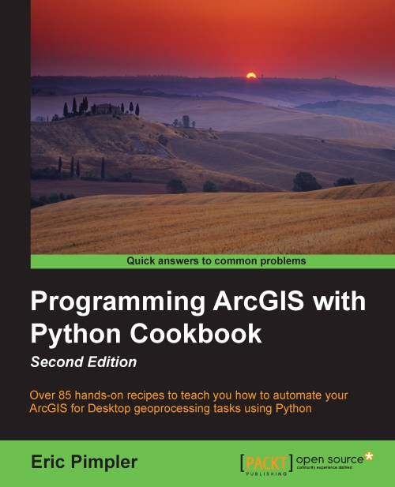

* [publisher](https://www.packtpub.com/application-development/programming-arcgis-python-cookbook-second-edition)  

## TOC
* [Chapter 1: Fundamentals of the Python Language for ArcGIS](Ch01_Fundamentals_of_the_Python_Language_for_ArcGIS.md)  
* [Chapter 2: Managing Map Documents and Layers](Ch02_Managing_Map_Documents_and_Layers.md)  
* [Chapter 3: Finding and Fixing Broken Data Links](Ch03_Finding_and_Fixing_Broken_Data_Links.md)  
* [Chapter 4: Automating Map Production and Printing](Ch04_Automating_Map_Production_and_Printing.md)  
* [Chapter 5: Executing Geoprocessing Tools from Scripts](Ch05_Executing_Geoprocessing_Tools_from_Scripts.md)  
* [Chapter 6: Creating Custom Geoprocessing Tools](Ch06_Creating_Custom_Geoprocessing_Tools.md)  
* [Chapter 7: Querying and Selecting Data](Ch07_Querying_and_Selecting_Data.md)  
* [Chapter 8: Using the ArcPy Data Access Module with Feature Classes and Tables](Ch08_Using_the_ArcPy_Data_Access_Module_with_Feature_Classes_and_Tables.md)  
* [Chapter 9: Listing and Describing GIS Data](Ch09_Listing_and_Describing_GIS_Data.md)  
* [Chapter 10: Customizing the ArcGIS Interface with Add-ins](Ch10_Customizing_the_ArcGIS_Interface_with_Add-ins.md)  
* [Chapter 11: Error Handling and Troubleshooting](Ch11_Error_Handling_and_Troubleshooting.md)  
* [Chapter 12: Using Python for Advanced ArcGIS](Ch12_Using_Python_for_Advanced_ArcGIS.md)  
* [Chapter 13: Using Python with ArcGIS Pro](Ch13_Using_Python_with_ArcGIS_Pro.md)  
* [Appendix A: Automating ](AppendixA_Automating_Python_Scripts.md)  
* [Appendix B: Five Python Recipes Every GIS Programmer Should Know](AppendixB_Five_Python_Recipes_Every_GIS_Programmer_Should_Know.md)  