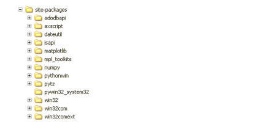
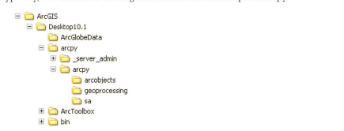

# Chapter 12: Creating Python functions and classes

<!-- toc orderedList:0 depthFrom:1 depthTo:6 -->

* [Chapter 12: Creating Python functions and classes](#chapter-12-creating-python-functions-and-classes)
  * [12.1 Introduction](#121-introduction)
  * [12.2 Creating functions](#122-creating-functions)
  * [12.3 Calling functions from other scripts](#123-calling-functions-from-other-scripts)
  * [12.4 Organizing code into modules](#124-organizing-code-into-modules)
  * [12.5 Using classes](#125-using-classes)
  * [12.6 Working with packages](#126-working-with-packages)
  * [Points to remember](#points-to-remember)

<!-- tocstop -->


## 12.1 Introduction

This chapter describes how to create custom functions in Python that can be called from elsewhere in the script or from another script.
Custom functions make it easy to reduce the code you have written to carry out procedures.
Functions are organized into modules, and modules can be organized into a package.
ArcPy itself is a collection of custom modules and functions organized into a package.
By creating custom functions , you can organize your code into logical parts and reuse frequently needed proce dures.
This chapter also describes h ow to create custom classes in Python , w hich m akes it easier to group together functions and variables


## 12.2 Creating functions

Functions are small blocks of code that perform a specific task.
Python itself has a great number of built-in functions and the ArcPy site package contains a large number of functions , including all the geoprocessing tools in ArcGIS.
You will use many built-in functions in a typical Python script, and yo u can import additional functionality from other modules, includ ing ArcPy.
Consider the random m odule, for example.
You can import this module for access to a number of different functions.
The fo llow ing code generate a random inteσer between 1 and 100:


```python
import random
x = random.randint(1, 100)
print x
```

    97


The code to generate a random number has already been written, and this code can now be freely used by anyone who needs it.
The code of the random module can be found in a file called random.py and is located in the Python Lib folder.
In a typical installation of Python 2.7 as part of the ArcGlS 10.1 installation, the path is: C:\Python27\ArcGlSl0.l\Lib\random.py.
You can open this script in a Python editor like PythonWin and examine the code.
Inside the code, you will find a reference to the randint function, as shown in the figure.


```python
def randint(self, a, b):
    return self.randrange(a, b+1)
```

In this example, the randint function calls another function called randrange .
The random module contains a number of different functions and some of them are closely related.
The point here is that the code to generate random numbers has already been written and shared with the Python user community.
So w henever your script needs a random number, you don't have to write the code yourself.
You can import the random module and use any of its functions.


In addition to using existing functions, you can create your own functions that can be called from w ithin the same script or from other scripts.
Once you write your own fun ctions, you can reuse them w henever needed.
This makes code more eff1 cient since there is no need to write the same task over and over.


Python functions are defined using the def statement, as shown in the figure.
The def statement contains the name of the function, followed by any arguments in parens.
The syntax of the def statement is


```python
def <functonname>(<arguments>):
```

There is a colon (:) at the end of the statement, and the code following a def statement is indented the same as any block of code.
This indented block of code is the function definition.
For example, consider the script helloworld.py as follows:


```python
def printmessage():
    print "Hello world"
```

In this example, the function printmessage has no parameters, but most functions use parameters to pass values.
Elsewhere in the same script, you can call this function directly, as follows:


```python
printmessage()
```

    Hello world


Typically, functions are quite a b it more elaborate.
Consider the following example: You want to create a list of the names of all the fields in a table or a feature class.
There is no function in ArcPy that does this.
However, the ListFields function allows you to create a list of the fields in a table, and you can then use a for loop to iterate over the items in the list to get the names of the fields.
The list of names can be stored in a list object.
The code is as follows :


```python
import arcpy
arcpy.env.workspace = "C:/Data"
fields = arcpy.ListFields("streams.shp")
namelist = []
for field in fields:
    namelist.append(field.name)
```

Now, say yo u anticipate that you will be using these lines of code quite often-in the same script or in other scripts.
You can simply copy the lines of code, paste them w here they are needed, and m ake any necessary changes.
For example, it is likely yo u will need to replace the parameter "streams.shp" with the feature class or table of interest.


Instead of copying and pasting code , yo u can denne a custom function to carry out the same steps.
First, you need to give the function a name - for example, listfieldnames .
The following code dennes the function:


```python
def listfieldnames():
```

You can now call the function from elsewhere in the script by name.
ln this example, when calling the function, you want to pass a value to the func tion-that the name of a table or a feature class.
To make this possible, the function needs to include a parameter to receive these values.
The parameter needs to be included in the dennition of the function, as follows:


```python
def listfieldnames(table):
```

Following the def statement is an indented block of code that contains w hat the function actually does.
This is identical to the previous lines of code, but now the hard-coded value of the feature class is replaced by the parameter of the function:


```python
def listfieldnames(table):
    fields = arcpy.ListFields(table)
    namelist = []
    for field in fields:
        namelist.append(field.name)
```

The last thing needed is a way for the function to pass values, also referred to as returning values.
This is necessary to ensure that the function not only creates the list of names, but also returns the list so it can be used by any code that calls the function.
This is accomplished using a return statement.
The completed description of the function is as follows:


```python
def listfieldnames(table):
fields = arcpy.ListFields(table)
namelist = []
for field in fields:
    namelist.append(field.name)
    return namelist
```

Once a function is dehned, it can be called directly from within the same script, as follows:


```python
fieldnames = listfieldnames ("C:/Data/hospitals.shp")
```

Running the code returns a list of the helds in a table using the function previously dehned.
Notice that the new function listfieldnames can be call directly, since it is dehned in the same script.


The example function used a parameter called table , which makes it possible to pass a value to the function.
The parameter is also referred to as an argument.
A function can use more than one parameter, and parameters can be made optional.
The arguments for optional parameters should be ordered so that the required ones are listed first, followed by the optional ones.
Arguments can be made optional by specifying default values


> Creating functions can be benehcial in a number of ways:
* If a task is to be used many times, creating a function can reduce the amount of code you need to write and manage.
The actual code that carries out the task is written only once as a function, and from that point on, you can call this custom function as needed.


> * Creating functions can reduce the clutter caused by multiple iterations.   For example, if you wanted to create lists of the held names for all the feature classes in all the geodatabases in a list of workspaces, it would quickly create a relatively complicated set of nested for loops. Creating a function for creating a list of field names removes one of these for loops and places it in a separate function.


> * Complex tasks can be broken into smaller steps.
By defining each step as a function, the complex task does not appear so complex anymore. Well-defined functions are a good way to organize longer scrípts.


Custom functions can be called not only directly from the same script, but also from other scripts, which is covered in the next section

## 12.3 Calling functions from other scripts

Once functions are created in a script, they can be called from another script by importing the script that contains the function.
For relatively complex functions, it is worthwhile to consider making them into separate scripts or script tools, especially if they are needed on a regular basis.

So rather than defining a function within a script, the function becomes a script in itself that can be called from other scripts.

Consider the earlier example of the helloworld.py script:


```python
def printmessage():
    print "Hello world"
```

The printmessage function can be called from another script by import ing the helloworld.py script.
For example, the script print.py does it, as follows:


```python
import sys
import os
import helloworld
helloworld.printmessage()
```

The script print.py imports the helloworld module.
A module name is equal to the name of the script minus the .py extension.
The func tion is called using the regular syntax to call a function-that is, <module>.<function>

In the example script, the helloworld module is imported into the print.py script.
Notice that there is no path associated with the module, but just the name itself, which is the name of another script.
So, the import statement causes Python to look for a file named helloworld.py.
No paths can be used in the import statement, and thus it is important to recognize where Python looks for modules.


The first place Python looks for modules is the current folder, which is the folder where the print.py script is located.
The current folder can be obtained using the fo Uowing code, where sys .
path is a list of system paths:


```python
import sys
pirnt sys.path[0]
```

The current folder can also be obtained using the os module, as follows:


```python
import os
print os.getcwd()
```

Next, Python looks at all the other system paths that have been set during the instaUation or subseguent conii.guration of Python itself.
These paths are contained in an environment setti ngs variable caUed PYTHONPATH.
This variable can be set to a list of paths that will be added to the beginning of the sys .
path list.
To view a comple te list of these paths, use the follow ing code:


```python
import sys
print sys.path
```

In a typical scenario, the list will include paths to both the Python instal lation and the ArcGIS installation.
The list will include paths like the following:


```python
C:\Python27\ArcGIS10.1
C:\Python27\ArcGIS10.1\Lib
C:\Python27\ArcGIS10.1\Libb\site-packages
C:\Program Files\ArcGIS\Desktop10.1\bin
C:\Program Files\ArcGIS\Desktop10.1\arcpy
C:\Program Files\ArcGIS\Desktop10.1\ArcToolbox\Scripts
```

> Note: The list of paths will vary based on how ArcGIS and Python is installed and the versions of the software.

What if the module yo u want to import is in a different folder-that is, not in the current fo lder of the script or in any of the folders in sys.path?
You have two options, as follows :


**1.Use a path configuration file (.pth).**


The most convenient way to access a module in a different folder is to add a path configuration file to a fo lder that is already part of sys.path.
It is common to use the site-packages folder-for example, C:\Python27\ArcGIS10.1\lib\site-packages.
A path configuration file has a .pth extension and contains the path(s) that w ill be appended to sys.path.
This file can be created using a basic text editor, and each line must contain a single path.
When ArcPy is installed as part of the ArcGIS installation, a path configuration file called Desktop10.1 .pth is placed in the site-packages folder of Python.
The file itself looks like the example in the figure.


The path configuration file makes all the modules located in the specific folders avai lable to Python You can create a .pth file yourself if yo u commonly work with scripts that are located in different folders.
For example, if the modules you want to import are in the folder C: \Sharedscripts, yo u wo uld create a .pth file and place it in the Python site-packages folder.
The file itself wo uld look like the example in the figure


**2. Append the path using code.**
You can also temporarily add a path to your script.
For example, if the scripts yo u w ant to call are in the folder C:\Sharedscripts, you can use the following code prior to calling the function: sys.path.append("C:/Sharedscripts")

Note: Because this is Python code, you need to use a fo war d slash (/) for the path The sys.path.
append statement is a temporary solution meant just so a particular script can call a function in another script


```python

```

## 12.4 Organizing code into modules

By creating a script that defines a custom function, you are turning the script into a module.
All Python script files are, in fact, modules.
That's why you can call the function by first importing the SCI (module), and then using a statement such as ```<module>.<function>```.
Recall the example:


```python
import random
x = random.randint(1, 100)
prlnt x
```


The random module consists of the random.py file and is located in one of the folders that Python automatically recognizes, C:\Python27\ArcGIS10.1\lib.
The random.py script (module) contains a number of functions, including randint.


This makes it easy to create new functions in a script and call them from another script.
However, it also introduces a complication: how do you distinguish between running a script by itself and calling it from another script?
What is needed is a structure that provides control of the execution of the script.
If the script is run by itself, the function is executed If the module is imported into another scribe the function is not executed until it is specifically called.


Consider the example hello.py script, which contains a function as well as some test code to make sure the function works :


```python
def pr ntmessage():
    print "Hello world"
print message()
```


This type of testing is reasonable, because when you run the script by itself, it confirms that the function works.
However, when you import this module to use the function, the test code runs, as follows:


```python
>>> import hello
"Hello world"
```


When you import the script file as a module, you don't want the test code to run automatically, but only when you call the specific function.
You want to be able to differentiate between running the script by itself and importing it as a module into another script.
This is where the variable ```__name__``` comes in (there are two underscores on eac h side).
For a script, the variable has the value of "```__main__```".
For an imported module, the variab le is set to the name of the module.
Using an if statement in the script that contains the function w ill make it possible to distinguish between a script and a module, as follows:


```python
def printmessage():
    print 'Hello world'
if __name__ == '__main__':
    print message()
```


In this case, the test of the m odule w ill be run only if the script is run by itself.
If you import the script, no code w ill be run until yo u call the function.


This structure is not limited to testing.
In some geoprocessing scripts, almost the entire script consists of one function or more, and only the very last lines of code actually call the fun cti on if, indeed, the script is run by itself.
The structure is as follows :


```python
import arcpy
import os
def mycooltool(<arguments>):
    <line of code>
    <line of code>
if __name__ == '__main__':
    mycooltool(<arguments>)
```


This structure provides control of the running of the script and make it possible to use a script in two different ways- running it by itself or calling it from another script.
Consider the earlier examp le of the random module.
The very last lines of code look like the example in the figure.


If the random.py script is run by itself, it will run the test function, as shown in the figure.


Running the script prod l1 ces output than can be examined to ensure the random function performs as expected.
The output from running the random.py script is as follows:


```python
2000 times random
0.0 sec, avg 0.490386, stddev 0.290 0 92, min 0.000360523, max 0.999743
2000 times normalvariate
0.015 sec, avg - 0.0379325, stddev 1.01517, min - 3.31413, max 3.54333
2000 times lognormvariate
0.0 sec, avg 1.55066, stddev 1.96947, min 0.0308862, max 24.7307
```

These results are printed only when the random.py script is run by itself and not when it is imported as a module into another script.


## 12.5 Using classes

In the previous sections, you saw how to create your own functions and organize your code into modules.
This substantially increases code reusability because you can write a section of code and use it many times by calling it from within the same script or from another script.
However, these func tions and modules have their limitations.
The principallimitation is that a function does not store information the way a variable does.
Every time a function is run, it starts from scratch.


In some cases, functions and variables are very closely related.
For example, consider a land parcel with a number of variables, such as the land-use type, total assessed value, and total area.
The parcel may also have procedures associated with it, such as how to estimate the property taxes based on land- use type and total assessed value.
These functions require the value of the variables.
These values can be passed to a function as arguments.
What if a function needs to change the variables?
The values could be returned by the function.
However, the passing and returning of vari ables can become quite cumbersome.


A better solution is to use a class.
A class provides a way to group together functions and variables that are closely related so they can inter act with each other.
A class also makes it possible to work with multiple objects of the same type.
For example, each land parcel is likely to have the same attributes.
The concept of grouping together functions and variables related to a particular type of data is called object-oriented programming (OOP).
Classes are the container for these related functions and variables.
Classes make it possible to create objects that have specific properties as defined by these functions and variables.


You have seen several ArcPy classes, such as the env class, which can be used to access and set environment settings, and the Result class, which defines the properties and methods of result objects that are returned by geoprocessing tools.
Being able to create your own classes in Python, however, opens up many new possibilities.


To make a class in Python, you use the keyword class .
Take a look at a simple example:


```python
class Person(object):
    def setname(self, name):
        self. name = name
    def greeting(self):
        print "My name is (0).".format(self.name)
```

The class keyword is used to create a Python class called Person .
The class contains two method definitions-these are like function definitions, except that they are written inside a class statement and are therefore referred to as methods.
The se1 f parameter refers to the object itself.
You can call it whatever yo u like, but it is almost always called "self" by conventlOn.


A class can be thought of as a blueprint.
It describes how to make some- thing and you can create many instances from this blueprint.
Each object created from a class is called an instance of the class.
Creating an instance of a class is sometimes referred to as instantiating the class.
Next, you will see how this class can be used


```python
me = Person()
```

Using an assignment statem ent creates an instance of the Person class.
Creating this instance looks like calling a function.
Once an instance is cre ated, yo u can use the properties and methods of the class, as follows:


```python
me.setname("Abraham Lincoln")
me.greeting()
```


Running this code prints the following:


```python
My name is Abraham Lincoln.
```


This examp le is relatively simple, but it illustrates some key concepts.
First, a class can be created using the class keyword.
Second, prop erties of the class are defllled as methods-they look like functions but are called m eth ods w hen they are defined inside a class.
Third, a class can contain multiple properties and methods.


Now return to the example of a parcel of land.
You want to create a class called parcel that has two properties (land-use typ e and total assessed value ) and a procedure (calculating tax ) associated with it.
For the purpose of this examp le, assume the prop erty tax is calculated as follows :


* For single-family residential, tax = 0.05 * value
* For multifamily residential, tax = 0.04 * value
* For all other land uses, tax = 0 .02 * value

Creating the Parcel class is coded as follows:


```python
class Parcel(object):
    def init (self, landuse, value):
        self.landuse = landuse
        self.value = value
    def assessment(self):
        if self.landuse == "SFR":
            rate = 0.05
        elif self.landuse == "MFR":
            rate = 0.04
        else:
            rate = 0.02
        assessment - self.value * rate
        return assessment
```

The class called Parcel is created using the class keyword.
The class contains two m e thods: **```__init__```** and assessment.


The **```__init__```** method is a special m ethod reserved for initializing obj ects inside a class-that is, constructing objects before they can be used.
This method has three arguments: **self, landuse, and value**.
When the class is called, however, the hrst argument (self) is not used.
The argument self rep resents the object and is provided for implicitly by calling the class.
The assessment m ethod is w here the actual calculation occurs.

Next, take a look at how to use this class.
The following code create s an instance of the parcel object:


```python
myparce1 = Parce1("SFR", 200000)
```


With the instance created, you can use its object properties and methods, as follows


```python
print "Land use: ", myparcel.landuse
mytax = myparcel.assessment()
print mytax
```

Running this code prints:


```python
Land use: SFR
10000
```

You can create multiple instances of this object.
In a typical scenario , you could run the property tax calculation for every parcel in a database , creat ing a new instance for each parcel.


In many cases, you m ay want to use the class in more than one script.
This can be accomplished by putting it in a module- that is, creating a sep arate script w ith the definition of the cJass, w hi ch can then be called from another script.
This is analogous to creating a separate script for a function , w hich can be called from other script, as described earlier in this chapter.


In this exampJe, the script containing the class is called parceJclass.py and is as follows:


```python
c1ass Parcel(object):
    def init (self, landuse, value):
        self.landuse = landuse
        self.value = value
    def assessment (self):
        if self.landuse == "SFR":
            rate = 0.05
        elif self.landuse == "MFR":
            rate = 0.04
        else:
            rate = 0.02
        assessment = self.value * rate
        return assessment
```

In this example, the script that uses the class is called parceltax.py and is as
follows.


```python
import parcelclass
myparcel = parcelclass.parcel("SFR", 200000)
print "Land use: ", myparcel.landuse
mytax = myparcel.assessment()
print mytax
```

## 12.6 Working with packages

When you have a number of different functions and classes, it often makes sense to put them in separate modules (scripts).
As your collection of modules grows, you can consider grouping them into packages.
A package is essentially another type of module, but it can contain other modules as well.
A regular module is stored as a .py file, but a package is a fo1der (or directory).
Technically speaking, a package is a folder with a file called "```__init__.py```" init.
This file defines the attributes and methods of the package.
It doesn't actually need to define anything; it can just be an empty file, but it must exist.
If ```__init__.py``` does not exist, the directory is just a directory, and not a package, and it can't be imported.
The ```__init__.py``` file makes it possib1e to import a package as a module.


For example, to import ArcPy, you use the import arcpy statement, but there is no script file called "arcpy.py.
"However, there is an arcpy fo1der with a file called "```__init__.py```".


For examp1e, if you had a package you wanted to call "mytools," you wou1d need to have a fo1der called "mytools" and inside this folder wou1d need to be a file called "```__init__.py```".
The structure of a package called mytools with two modules (analysis and model) would look as follows:


```python
-/Python-a directory in PYTHONPATH
-/Python/mytools-a directory for the mytools package
-/Python/mytools/in.py-package code
-/Python/mytools/analysis.py-analysis modu1e
-/Python/mytools/model.py-model modu1e
```

To use the package, your code would look as follows:


```python
import mytools
output = mytools.analysis.<function>(<arguments>)
```

You may wonder what a site package is.
A site package is a locally installed package that is available to all users using that computer.
The "site" is the local computer.
What makes a package a site package has to do with how it is installed, and not its actual contents.
During the installation of a site package, the path to the package is added to the PYTHONPATH variable As a result, the package can be directly imported wi thout first having to add the path.


Python has a number of built-in site packages, which can be fo und in the Lib\site-packages folder.
You will see PythonWin listed there.
Parts of the PythonWin editor are installed as a site package, although the actual application is a file called PythonWin.exe, which is located outside the package.
Anoth er commonly used site package is N umPy, whic h is us ed to manipulate large arrays of data.



ArcPy is referred to as a site package because a typical ArcGIS instal lation includes both ArcPy and Python, and the folder where ArcPy is located is automatically recognized by Python through the Desktop10.1.pth file located in the Lib\site-packages folder.
Where exactly is ArcPy installed?

Typically the location is C:\Program Files\ArcGIS\Desktop10.1\arcpy.




> Note: Although the preceding path is the default location for the installation of ArcGIS, it can vary depending on the operating system and the user-defined selections during installation.
However, if you can find the ArcGIS installation folder; you will also be able to find the arcpy folder.

When you explore the conten ts of this folder, you will find a subfolder called arcpy (which gives ArcPy its name), as shown in the figure, and w hich contains a file called **```__init__.py```**, which m akes it a Python package, in addition to many files whose names sound familiar (analysis.py, cartography.py, geocoding.py and more).


Normally, you should never work with these files directly, but for educational purposes, it is OK to examine them.
Just don't make any changes!
As part of the installation of ArcPy, the path C :\Program Files\ArcGIS\ Desktop10.1\arcpy is added to the PYTHONPATH environment variable in Windows and you can start using ArcPy immediately.

## Points to remember

* Custom functions can be created using the def statement.
The block of code that follows the def statement defmes what the function actually does.
Custom functions can contain arguments, although they are not required.


* Custom functions can be called from within the same script or from another script.
When calling a function from another script, you import the script that contains the function as a module.
A custom module is therefore a regular .py file that contains at least one custom function.


* To distinguish between running a script by itself and importing it as a module into another script, you can use the **```if __name__ == '__main__'```** :statement


* When importing modules, you cannot use paths, and modules (scripts) need to be located in the same folder as the script import ing the module(s) or in the folders included in the PYTHONPATH environment variable.
As needed, you can permanently add a path by using a .pth file in the site-packages directory or temporarily add a path in your script using the sys.path.append statement.


* Custom classes can be created to make it easier to group together functions and variab1 es related to a particular item.
Classes can be called from within the same script or from another script.


* As your collection of custom functions and classes grows , yo u can consider making it a package, similar to the ArcPy site package


```python

```
