# Chapter 13: Creating custom tools

<!-- toc orderedList:0 depthFrom:1 depthTo:6 -->

* [Chapter 13: Creating custom tools](#chapter-13-creating-custom-tools)
  * [13.1 Introduction](#131-introduction)
  * [13.2 Why create your own tools?](#132-why-create-your-own-tools)
  * [13.3 Steps to creating a tool](#133-steps-to-creating-a-tool)
  * [13.4 Editing tool code](#134-editing-tool-code)
  * [13.5 Exploring tool parameters](#135-exploring-tool-parameters)
  * [13.6 Setting tool parameters](#136-setting-tool-parameters)
    * [Type](#type)
    * [Direction](#direction)
    * [MultiValue](#multivalue)
    * [Default](#default)
    * [Environment](#environment)
    * [Filter](#filter)
    * [Obtained from](#obtained-from)
    * [Symbology](#symbology)
  * [13.7 Examining an example script tool](#137-examining-an-example-script-tool)
  * [13.8 Customizing tool behavior](#138-customizing-tool-behavior)
  * [13.9 Working with messages](#139-working-with-messages)
  * [13.10 Handling messages for stand-alone scripts and tools](#1310-handling-messages-for-stand-alone-scripts-and-tools)
  * [13.11 Customizing tool progress information](#1311-customizing-tool-progress-information)
  * [13.12 Running a script in process](#1312-running-a-script-in-process)
  * [Points to remember](#points-to-remember)

<!-- tocstop -->


## 13.1 Introduction

This chapter describes the process of turning a Python script into a tool.
Tools make it possible to integrate your scripts in ArcGIS.
Tools can be run from ArcToolbox, can be used w ithin a model , and can be called by other scripts.
__Tools have a tool dialog box, which typically contains the parameters that are passed to the script.__
Developing tools is relatively easy and greatly enhances the experience of using a script.
Tool dialog boxes reduce user error because parameters can be specified using drop-down lists, check boxes, combo boxes, and other m echanisms.
This provides substantial con trol of user input, grea tl reducing the need to write a lot of error-checking code.
Creating tools also makes it easier to share scripts with others.


## 13.2 Why create your own tools?

Many ArcGIS workflows consist of a sequence of operations in which the output of one tool becom es the input of another tool.
ModelBuilder and scripting can be used to automatically run these tools in a sequence.
Any model created and saved using ModelB uilder is a tool because it is located in a toolbox (.tbx file) or a geodatabase.
A model , therefore, is always run from within an ArcGIS for Desktop app Jication, such as ArcMap or ArcCatalog.
A Python script (.py file) , however, can be run in two ways:

__1. As stand- lone script.__
This means the script is run from the operating system or from within a Python editor, such as PythonWin.
For a script to use geoprocessing tools, ArcGIS for Desktop needs to be installed and Jicensed, but no ArcGIS for Desktop application needs to b e open for the script to run.
For example, you can schedule a script to run at a prescribed time directly from the operating system.

__2. As tool within ArcGIS.__
This means the script is turned into a tool to be run from within an ArcGIS for Desktop application.
Such a tool is like any other tool: it is located in a toolbox, can be run from a tool dialog box, and can be called from other scripts, models, and tools.


__There are a number of advantages to using tools instead of stand-alone scrípts.__
* A tool includes a tool dialog box, which makes it easier for users to enter the parameters using built-in validation and error checking.
* A tool becomes an integral part of geoprocessing. This makes it possible to access the tool from the Catalog and Search windows in ArcMap. It also makes it possible to use the tool in ModelB uilder and in the Python window, and to call it from another script.
* A tool is fully integrated with the application it was called from. This means any environment settings are passed from the application , such as ArcMap, to the tool.
* The use of tools makes it possible to write messages to the Results window
* Documentation can be provided for tools, which can be accessed like the documentation for system tools.
* Sharing a tool makes it easier to share the functionality of a script w ith others.
* A well-designed tool means a user reguires no knowledge of Python to use the tool's functionality.


## 13.3 Steps to creating a tool

A tool is created using the following steps:
1. Create a Python script and save it as a .py file
2. Create a custom toolbox (.tbx file) where the tool can be stored.
3. Add a tool to the custom toolbox using the Add Script wizard
4. Modify the script with input and output variables so that it is seamlessly integrated into the geoprocessing framework.

You can create a new custom toolbox in ArcCatalog or in the Catalog window inside another ArcGIS for Desktop application. Navigate to Toolboxes, rightclick My Toolboxes, and click New > Toolbox. Give the toolbox a name.

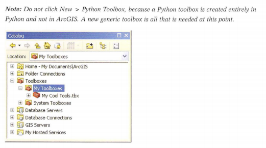

This section describes how to create a script tool using a custom toolbox.
Although ArcGIS 10.1 has introduced Python toolboxes, w hich support
additional capabilities to custom toolbox, it is more convenient to use a
custom toolbox when starting to create your first script tools.

Your empty custom toolbox can now be added to ArcToolbox. You can
drag it from the Catalog window into ArcToolbox or right lick inside
ArcToolbox and click Add Toolbox, whic h allows you to browse for a toolbox in any folder.


A toolbox, w hi ch consists of a single .tbx fi le, can be located anywhere on your computer.
The folder My Toolboxes is one logicallocation to organize custom toolboxes, but they can also be located in any folder w here datasets and other files for a parti cular project are organized-for example, __C:\EsriPress\Python\Data\MyCooITools.tbx.__
Custom toolboxes can also be located inside a geodatabase.
Like other ele ments, a toolbox inside a geodatabase no longer has a file extension-for example, __C:\EsriPress\Python\Data\study.gdb\MyCoolTools__.

To create a tool, in ArcToolbox, right-click a custom toolbox and click Add > Script.
Write access to the toolbox is needed to be able to add a new tool.
As a result, you cannot add tools to any of the system toolboxes in ArcToolbox.

The Add Script wizard has three panels.
The first panel is used to specify the script name, label , and description.
The second panel is used to specify the actual script file (.py), including its path.
The third panel is used to specify the tool's parameters.
Each of these panels is reviewed here in detail.

The example script that comes next illustrates how to create a tool.
This script creates a list of all the feature classes in a workspace and copies these feature classes to an existing file geodatabase, as follows:


```python
# Python script : copyfeatures.py
# This script copies all feature classes from a workspace into
# a file geodatabase .
# Import the ArcPypackage .
import arcpy
import os

# Set t he curre nt workspace .
from arcpy import env
env.workspace = "C:/Data"

# Create a list of feature classes the current workspace .
fclist = arcpy.ListFeatureClasses()
# Copy each feature class to a file geodatabase - keep the same
# name but use the basename property to remove any file
# extensions, includng.shp.

for fc in fclist:
  fcdesc = arcpy.Describe(fc)
  arcpy.CopyFeatures_management(fc, os.path.join("C:/Data/study.gdb/", fcdesc.basename))
```


```python
# %load Ch13/Tools/Scripts/copyfeatures.py
import arcpy
import os
from arcpy import env
env.workspace = arcpy.GetParameterAsText(0)
outworkspace = arcpy.GetParameterAsText(1)
fclist = arcpy.ListFeatureClasses()
fcount = len(fclist)
arcpy.SetProgressor("step", "Copying shapefiles to geodatabase", 0, fcount, 1)
for fc in fclist:
    arcpy.SetProgressorLabel("Copying" + fc + "...")
    fcdesc = arcpy.Describe(fc)
    outfc = os.path.join(outworkspace, fcdesc.baseName)
    arcpy.CopyFeatures_management(fc, outfc)
    arcpy.SetProgressorPosition()
arcpy.ResetProgressor()
```

This script is written as a stand-alone script.
Both the current workspace and the file geodatabase are hard-coded in the script.
Although the script will run correctly, it will require modification to be useful as a tool.

To start the Add Script wizard, in ArcToolbox, right click a custom toolbox and click __Add > Script__.
This brings up the fi.rst panel of the wizard , as shown in the figure.

The first panel of the wizard is used to specify the tool name, label , description, and style sheet as follows:

* The name of a tool is used when you want to run a tool from Python. The name cannot contain any spaces.
* The label of the tool is the display name in ArcToolbox. The label name can have spaces.


__Consider the example of the Get Count tool.__
In ArcToolbox, the tool appears with its label, Get Count (with a space), but for the tool to be called from Python, its name, GetCount (without a space) , is used .

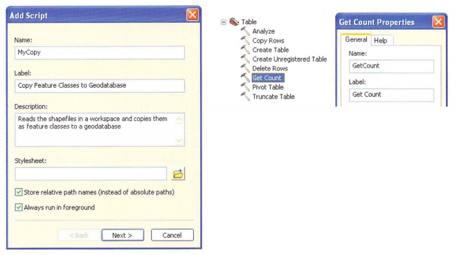

* The description is an optional held to provide a customized description.
The text is automatically used to provide the contents of the Help panel on a tool dialog box

* An optional style sheet can be selected.
If none is selected, the default style sheet is used.
Style sheets are used to control the properties of items on a tool dialog box.
A style sh eet provides style and layout information.
All the system tools in ArcToolbox use the default style sheet picall you want your c ustom tools to lok just like th e system tools so the d e fault sty le sheet is us ually sufficient.

* Optionally, the "Store relative path names" check box can be selected.
When it is selected, relative paths are used instead of absolute paths to reference the location of the script file in re lation to the location of the custom toolbox (.tbx) file.
Only the path to the script file can be stored as a relative path; paths within the script itself will not be converted.
If you are going to share the tool with others, it is a good idea to select this check box.

* Optionally, the "Always run in foreground" check box can be selected.
This will ensure the script is run using foreground processing, even if background processing has been enabled under Geoprocessing Options.
(Background processing allows you to continue to work in the ArcGlS for Desktop application while the tool is running.) Some scripts require foreground processing-for example, mapping scripts, which us the CURRENT keyword to obtain the active map document in ArcMap.
For other scrip selecting foreground or background processing is a matter of preference.


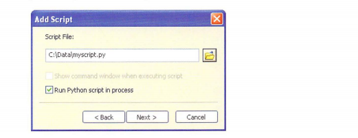

__In the second panel of the Add Script wizard__, you can set the following:

* The complete path of the Python script file to be run.
You can browse to an existing file or type the path of a file.
If you specify a script file that does not exist, you will be prompted to create a new (empty) script file.
Alternatively, the script file field can be left blank and added later.
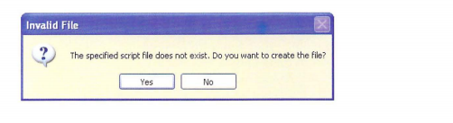

* The "Show command window when executing script "check box, which is cleared by default.
When the box is selected, an additional window appears during tool execution to show messages that are not part of the regular geoprocessing messages but are written to the standard output for Python.
For example, the Python print statement writes to the standard output, such as the Interactive Window in PythonWin.
If such statements are part of your script, the mes sages wo uld not appear unless this box is selected.
Scripts that are referenced by a tool should normally use geoprocessing messaging and not write to the standard output.
So the box remains clear unless you have very specific needs for viewing messages.

* The "Run Python script in process" check box, which is se lected by default .
Python scripts run faster if they are run "in process, " so typically you'll want this option selected.
Running in process uires that Python modules in your script be designed to run in process, w hich is the case for standard modules s uch as OS , math , and string.
Nonstandard modules from third parties may not be designed for this process, which can result in performance issues.
So if yo u are using third-party modules in your script, which appears to result in unexpected problems, you can try running the script out of process instead


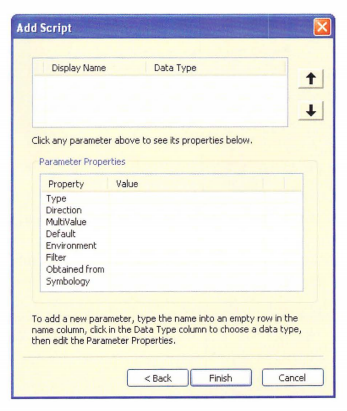

__The third panel of the Add Script wizard is used to specify the tool parameters.__
By default, no parameters are listed, but most tools need at least one input parameter and one output parameter.
The top half of the panel allows yo u to create parameters and the bottom half allows yo u to set the properties for eac h of these parameters.
Setting parameters is covered in detaillater in this chapter, including parameter properties.

To complete the Add Script wizard, click the Finish button.
Completing this wizard adds a toolbox.

your custom toolbox.


All the settings in the Add Script wizard can be modi&ed by right-clicking the tool and clicking Properties.
The Properties dialog box of the tool incJ udes tabs for General , Source, and Param eters, which correspond to the three panels of the Add Script w izard.
Two additional tabs oll the dialog box are Validation and Help.
These tabs are revisited later in this chapter.
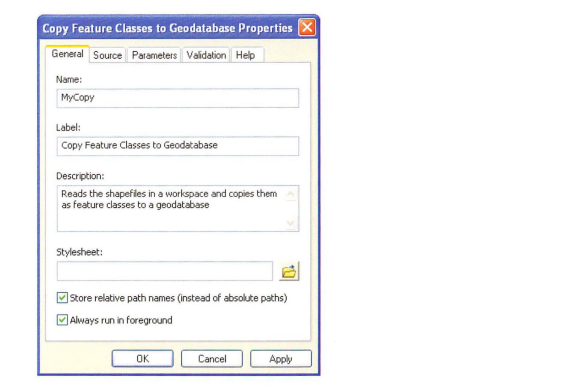

Your new toolcan be accessed just like a regular tool.
Right lick the tool and click Open or simply double-click the tool in its toolbox.
The tool dialog box seems empty at this point because to parameters were set in the third panel of the Add Script wizard.
The Help panel on the right shows the tool's description, but there are no parameters yet.
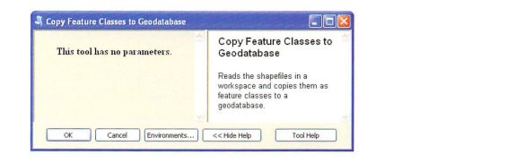

Clicking OK runs the tool-that is, runs the script-but without parameters , it does not provide the user with any control over its execution.
One of the most critical steps in creating tools is to create input and output parameters and add them to the tool's dialoσbox.
__Remember, however, that the script was written to run as a stand-alone tool.
Setting parameters therefore requires modifying the code in the script so it can receive the parameters set by the tool dialog box.__


## 13.4 Editing tool code

When you create a tool, you typically have to make changes to the script so that the tooldialog box and the script can interact seamlessly.
When testing a tool, you will alternate between running the tooland editing the script untilthe toolworks as desired.
You can leave the Python editor open while you do it.
You can open a script from within the Python editor, but there is also a shortcut in ArcGIS.
Right-click the toolin the toolbox and click Edit This will open the Python script in a Python editor such as IDLE or PythonWin.
The Python editor that is used is determined by the geoprocessing options.
To change these settings, on the menu bar in an ArcGIS for Desktop app lication, click Geoprocessing > Geoprocessing Options.

To select PythonWin as the editor, browse to the location of the PythonWin application.
Typically, this application is located at C:\Python27\ArcGIS10.1\Lib\site-packages\PythonWin\PythonWin.
exe, but this may vary depending on how Python was installed on your computer.
Once you set a speci&c editor, any script &le opened from within ArcGIS will open in this editor.

Now that a toolis created and you can access its code, it is time to take a closer look at parameters.


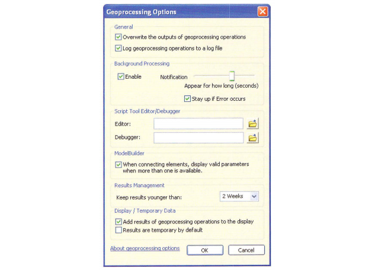

## 13.5 Exploring tool parameters

As yo u have seen in several earlier chapters, all geoprocessing tools have param eters .
Param eter values are set on the tool dialog box.
In a stand- alone script, param eters are typically set within the script unless user input is expected.
For tools, param eters can be set using the tool dialog box.
When a tool runs, the param eter values from the tool dialog box are passed to the script.
The script reads these values and uses them in the code.
Creating and exposing param eters requires the following steps:

* Including code in the script to rece ive the parameter values
* Setting up the param eters in the tool's properties

Next, you will try this out by using one of the builtin tools, the M ultip le Ring Buffer too l.
The tool dialog box is shown in the figure.

The Multiple Ring Buffer tool has seven parameters total, three of which are optional.
The Param eters tab on the tool properties dialog box lists the same seven parameters, in the same order, as the tool dialog box.
It also shows the data type of each parameter.
For example, the input features consist of a feature layer, and the buffe r unit is a string value.


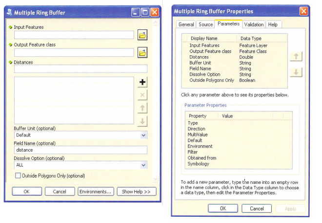

> Note: Because the Multiple Ring Buffer tool built-in tool, you can see the list of parameter but you cannot see or edit  the parameter properties.
A nd because the parameters are read-only, the entire panel appears dimmed.
If you want to read more about the meters you can copy the tool to a custom toolbox, which proνides read/write ppermission to access its properties


Once a user specifies the parameter values on the Multiple Ring Buffer tool dialog box, the tool can be run.
Once the tool is run, the user-specified parameter values will be passed to the script.
Take a look at the script's code to see how these parameter values are received by the script.
The example __MultiRingBuffer.py__ script, which is shown in the PythonWin editor in the figure, includes the import of a number of modules and some introductory comments, and then contains a section of code where the parameter values are received.


```python
import arcgisscripting
import os
import sys
import types
import locale
gp = arcgisscripting.create(9.3)

# Define message constants so they may be translated easily
msgBuffRings  = gp.GetIDMessage(86149)  # "Buffering distance"
msgMergeRings = gp.GetIDMessage(86150)  # "Merging rings..."
msgDissolve   = gp.GetIDMessage(86151)  # "Dissolving overlapping boundaries..."

def initiateMultiBuffer():
    # Get the input argument values
    # Input FC
    input = gp.GetParameterAsText(0)

    # Output FC
    output = gp.GetParameterAsText(1)

    # Distances
    distances = gp.GetParameter(2)

    # Unit
    if unit.lower() == "default":
    unit = ""

    # If no field name is specified, use the name "distance" by default
    fieldName = checkFieldName(gp, gp.GetParameterAsText(4), s.path.dirname(output))

    # Dissolve option
    dissolveOption = gp.GetParameterAsText(5)

    # Outside Polygons
    outsidePolygons = gp.GetPararneterAsText(6)
    outsidePolygons.lower() == "true":
        sideType = "OUTSIDE ONLY"
    else:
        sideType = ""

createMultiBuffers(gp, input, output, distances, unit, fieldName, disslveOption, sideType)

```

The tool's parameters are received by the script using the GetParameterAsText and the GetParameter functions.
This script uses the ArcGISscripting module from version 9.3, but the concept is the same.
The syntax of the GetParameterAsText function is

__```<variable> = arcpy.GetParameterAsText(<index>)```__

The only argument of this function is an index number on the tool's dialog box, which il1 dicates the numeric position of the parameter.
The parameters set on the tool dialog box are sent to the script as a list and the GetParameterAsText function assigns these parameter values to variables in the script.
The two figures (see below and facing page ) show how each parameter 011 the tool dialog box matches the code index number-for example, Input Features is (0), Output Feature class is (1) , al1 d Distances is (2).


The GetParameterAsText function receives parameters as a text string , even if the parameter on the tool dialog box is a different data type.
Numerical values, Boolean values, and other data types are all converted to strings and additional code is included to correctly interpret these strings.
For example, the code of the Outside Polygons Only parameter is as follows:


```python
outsidePolygons = gp.GetParameterAsText(6)
if outsidePolygons.lower() == "true":
    sideType = "OUTSIDE_ONLY"
else:
    sideType
```

The Outside Polygons Only parameter on the tool dialog box is a Boolean value of True or False.
These values are converted to strings, and as a result, the conditional statement uses the string value " true " instead of the Boolean value True.


The Distances parameter on the tool dialog box is received by the script using the GetParameter function.
This is because the parameter consists of a list of values (doubles) instead of a single value .
The GetParameter function ds this list as an Object.


> Note: An altemative to using the GetParameterAsText and GetParameter functions is to use sys.argv, or system arguments.
The use of sys.argv has certain limitations, including that it accepts a limited number of characters.
Using the GetParameterAsText and GetParameter functions is therefore preferred.
Prior to ArcGIS 9.2, these functions would work only for tools referencing a script, and __stand-alone scripts could use only sys.argv__.
The latter is therefore relatively common in older scripts.
__The index mumber for sys.argv starts at 1, so sys.argv[1] is equivalent to GetParameterAsText(0)__


Every tool parameter has an associated data type.
One of the benefits of data typ es is that the tool dialog box w ill n ot send values to the scrip t unl ess they are the correct data type.
User entries for p aram ete rs are ch ecked against the p aram eter data typ es b efore they are sent to the script.
This is one advantage of using tools over stand-alone scripts becaus e the script does not have to check for invalid parameters.

The data types of the parameters of the Multiple Ring Buffer tool include a feature layer, a feature class , a double, three strings, and a Boolean .
Many more data types are possible for th e p arameters of a cust too l, from an address locator to a Z domain Data types of parameters should be selected carefully because they control the interaction be tween the tool dialog box and the script.


After parameters are assign ed a data type, the to ol dialog b ox uses this data type to c heck the parameter value.
For examp le, if you enter a path to an element of a different data type, the tool dialog box will gen erate an error.
In the example in the two n gures, the Input Features param e ter is a feature layer (upper right) , so typing the path for a raster, such as C:\Data\dem , will generate an erro r (lower right) and prevent the tool from running.
This built-in error- checking m ech anism prevents users from u sing incorrect param eters to run a tool.
When the tool runs, the dialog b ox h as already validated the parameter Input Features as a feature layer, and no additional code is needed in the script to verify it.

The data type property is also used to browse through folders for data.
Only data that match es the parameter's data type will be shown .
This prevents the entering of incorrect paths to data

## 13.6 Setting tool parameters

Tool parameters can be set in the Add Script wizard when creating the tool.
They can also be edited after the tool has been created by accessing the tool's properties dialog box.
Setting parameters is the same, no matter which method is used.

A parameter is added by placing the cursor in the first empty cell in the Display Name column, under the Parameters tab, and typing a name for the parameter, which is displayed on the tool dialog box.
Next, the data type is specified by selecting from an extensive drop down list.


You can add more parameters by repeating these steps.
Once multiple parameters are created, the order can be changed by selecting one and using the arrowkeys to move the row up or down.

Each parameter has a number of properties, as shown in the bottom half of the dialog box.
When each parameter is created, its properties are set to default values based on the parameter's data type.
Some of the key parameters are discussed as follows.
A complete description of all the parameters can be found in ArcGIS Desktop Help, under the topic "Setting script tool parameters."

### Type

There are three choices for Type: Requi red, Optional, and Derived Required means that a parameter value needs to b e specified for a tool to run.
Optional means that a value is not requi red fo r a script to run.
TPI cally, this mean s that a default value is specified.
Derived parameters are used for output paramete rs only and do not appear on the tool dialog box.

Derived paramete rs are used in a number of cases, including the following:

* When a tool outputs a single value instead of a dataset. Such a single value is often referred to as a scalar.
* When a tool creates outputs using information from other parameters.
* When a tool modifies an input without creating a new output.

All tools should have outputs so that the tool can be used in a model.
Sometimes the only way to accomplish this is by using derived parameters.
Examples of tools with derived param eters include the Get Count tool and the Add Field too1.

The input parameter of the Get Count tool is a feature class, table, layer, or raster, and the output is a count of the number of rows.
This count is a scalar variable and is returned as a result object.
It comprises an output parame ter and is a derived parameter that does not appear on the tool dialog box.


The Add Field tool adds a new held to an input table.
The input table is a reguired parameter, and so is the name of the new field.
The rest of the parameters are optional, as shown in the figure.

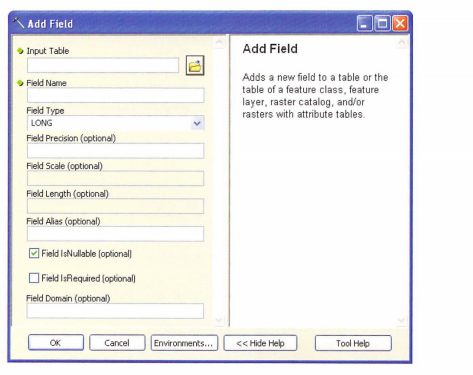

When the tool runs, a new field is added based on the input parameters.
The output of the tool is the modified table or feature class.
Because this table or feature class is an input parameter, there is no need to specify the output on the tool dialog box.
The output of the tool is therefore specified as a derived parameter.
An easy way to visualize it is by using the tool in a model , as shown in the figure.

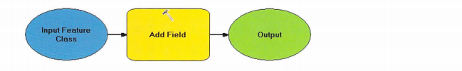


When you inspect the properties of the input feature class and the output, yo u will notice that they reference the exact same feature class.
In fact, you cannot specify or change the name of the output (you can change the display name in the model but not the underlying data)

> __Note: Running the Get Count tool as a single tool from ArcToolbox is not common__.
Although the count is printed to the Results window, this tool is typically used within a model of a script where the output is used as the input to another step.
__The Get Count tool is also cocommonly used in conditional statements.__
For example, a particular procedue can be stopped if the count of rows is zero (0).


### Direction

The Direction property __defines whether the parameter is an input of the tool or an output of the tool.__
For derived parameters, the parameter direction will __automatically be set to output__.
__Every tool should have output parameters.
This makes it possible to use the tool in ModelBuilder.__
Although technically a script can run without output parameters, for ModelBuilder to work, every tool needs an output so it can be used as the input to another tool in the model


### MultiValue

Some tool parameters consist of a list of values rather than a single value.
When the MultiValue property is set to No , only a single value can be used.
When the MultiValue property is set to Yes, a list of values can be used.

__Multivalue parameters are quite common for built-in geoprocessing tools.__
For example, the Union tool uses a list of input feature classes.
The Union tool uses the default multivalue parameter control , which is simply a list of inputs that can be added, removed, and reordered.


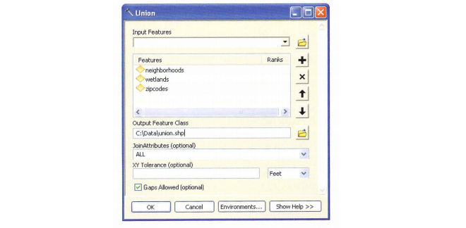


The second type of multivalue parameter is a list of check boxes.
This is commonly used for fields, as illustrated by the Delete Field tool.
Check boxes can also be used if a Value List filter is applied, which is discussed later in this section.

__Multivalue parameters are passed to the script as a delimited string, with the individual list elements separated by semicolons (;).__
The Python split method can be used to create a list of the elements from the string.
The syntax is as follows:
```py
import arcpy
input = arcpy.GetParametersAsText(0)
inputList = input.split(";")
```

As an alternative, you can use GetParameter to obtain a __ValueTable object__ instead of a string.
In a ValueTable, the values are stored in a virtual table of rows and columns.
__ValTable objects are specially designed for multivalue parameters.__

This means that when writing the script, you need to be aware of the parameter types being passed to the script from the tool dialog box.

### Default

The default value of a parameter is the contents of the parameter when the script tool 's dialog box is open .
If no default value is specified, the parameter value will be blank on the tool's dialog box.
If a default value is specified, the Environment property will be disabled.


### Environment

A default value for a parameter can also be speci&ed using the Environment property.
By right-clicking the cell next to Environment, you can choose the name of the environment setting.
Once this property is set, the default value is obtained from the environment settings of the geoprocessi framework.
If the Environment property is spec i& ed, the default property will be ignored-so you need to specify one or the other.


### Filter

The Filter property allows you to limit the values of dataset types to be entered for a parameter.
There are a number of &lter types, and the type depends on the data type of the parameter.
The different filter types are Value List, Range, Feature Class, File, Field, and Workspace.

For most data types, there is only one filter type.
For example, if the data type of a parameter is set to Feature Class, the only possible filter type   is Feature Class.
The only exceptions are the Long and Doubles data types, which have Value List and Range as possible filter types.
Many data types have no filter type at all.

The different &lter types provide speci&c control of which parameters are valid inputs.
Carefully setting the &lter type will improve the robustness of the tool.
The different filter types are discussed in more detail in ArcG1S Desktop Help , under the topic "Setting script tool parameters."


### Obtained from

In many cases, a tool parameter is closely related to another one.
For example, consider the Delete Field tool.


The first parameter is an input table, and the second parameter, Drop Field, is a list of fields.
The list of fields is populated only when the input table is selected, as shown in the figure.

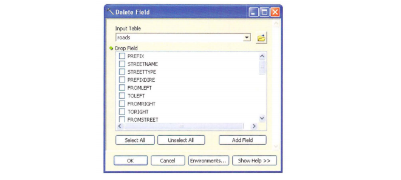


This dependency of a parameter on another parameter in the same tool is controlled using the "Obtained from" property.
In the example of the Delete Field tool , the Obtained from property of the Drop Field parameter is set to the input table .

A second reason to use the Obtained from property is to work with derived output parameters.
For example, when an input parameter is modified by a tool, the Obtained from property of the derived output parameter is set to the input parameter.
ln the case of the Delete Field tool, the Obtained from prop erty of the output parameter is set to the input table.

### Symbology

By default, the output of a geoprocessing tool is added to the ArcMap tab le of contents.
This behavior can be set on the G eoprocessing Options dialog box under Display/Temporary Data.

The symbology of a layer added in thi s way foll ows the same rules as w h en data is added using the Add Data option in ArcMap-in other words, there is no customized symbology.
The Sy mbology property can b e set to a custom layer file (.Iyr).
This option is available only for outputs w h ere layer &les m ake sen se, such as featu classes rasters, TINs, and the like.
The parameter type can be reguired or derived, but the parameter direction has to be set to o utput for the Symbology property to be accessible.


Notice that setting the Symbology property does not control w h ether the output w ill b e added to the table of contents, because this is controlled by Geoprocessing Options in ArcMap.


## 13.7 Examining an example script tool

The following example illustrates the steps to convert a stand-alone script to a script tool.
The following stand-alone script was introduced at the beginning of the chapter.
The script creates a list of all the shapefiles in a workspace and copies them to a geodatabase.
For the purpose of this example, the script is located in the C:\Sharedscripts folder. The script is as follows


```python
# Python script : copyfeatures.py
# This script copies all feature classes from a workspace to
# a file geodatabase.

# Import the ArcPy package .
import arcpy
import os

# Set teh current workspace.
from arcpy import env
env.workspace = "C:/Data"

# Create a list of feature classes in the current workspace
fclist = arcpy.ListFeatureClasses()

# Copy each feature class to a file geodatabase - keep the same
# name but use the basename property to remove any file
# extensions including.shp
for fc in fclist:
    fcdesc = arcpy.Describe(fc)
    arcpy.CopyFeatures_management(fc, "C:/Data/study.gdb/" + fcdesc.basename)
```

Two workspaces hard-coded into the script have to be modified to parameters using the GetParameterAsText function.
The revised script (without comments) is as follows:


```python
import arcpy
import os
from arcpy import env
env.workspace = GetParameterAsText(0)
utgdb = GetParameterAsText(1)
fclist = arcpy stFeatureClasses()
for fc in fclist:
    fcdesc = arcpy.Describe(fc)
    arcpy.CopyFeatures_management(fc, os.path.join(outgdb, fcdesc.basename))
```

A custom toolbox is created in the My Toolboxes folder This empty toolbox can be dragged to ArcToolbox.

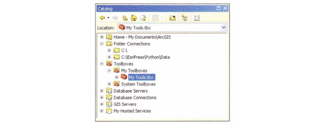

To create a new script tool , right-click the custom toolbox and click __Add > Script__.
ln the first panel on the Add Script dialog box, specify the name, label, and description of the script tool.
Select the check boxes for storing relative path names and foreground processing.

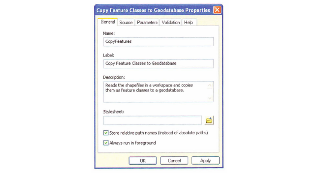

In the second panel on the Add Script wizard, browse to the l0cation of the script file-in this case, __C:\Sharedscripts\copyfeatures.py.__
Leave the other settings to their defaults.


In the third panel on the Add Script wizard, you can specify the parameters.
For the first parameter, enter the name Input Workspace and select Workspace for Data Type.


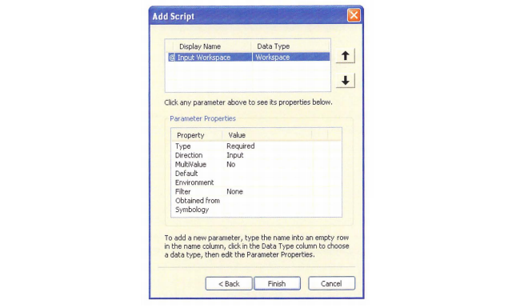

Under Parameter Properties, click the Filter property.
Under Value, select Workspace.
This brings up the Work space filter.
Under Type, clear the check boxes for "Local database" and "Remote database."


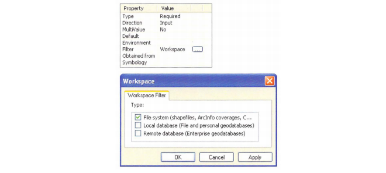

For the second parameter, enter the name Output Workspace and select Workspace for Data Type
Under Parameter Properties, set Direction to Output.


In the Add Script wizard, click Finish to complete creating the script tool.
After the parameters are added and the properties are set, the tool dialog box should look like the example in the figure.

The tool is now ready to run.
The tool copies the shape files to a geodatabase, and the output of the tool is the geodatabase workspace.
The copied feature classes themselves will not be added to the ArcMap table of contents - this is by design because the number of feature classes could conceivably be very large.


## 13.8 Customizing tool behavior

Once a tool's parameters are specified, you can add custom behavior.
Examples of custom behavior include the following:
* Certain parameters may need to be enabled or disabled based on the values contained in other parameters.
* Some parameters may benefit from having a default value specified based on the values in other parameters
* If there are a lot of parameters, it may be more effective to organize parameters into different categories.
* Warning and error messages may need to be customized

Tool behaviors can be set on the Validation tab on the Script Properties dialog box.
In the Validation panel, you can use Python code that uses a Python class called ToolValidator .
The ToolValidator class controls how the tool dialog box is changed based on user input.
It is also used to describe the output data the tool produces, which is important for using tools in ModelBuilder.

The ToolValidator class was introduced in ArcGIS 9.3, providing more possibilities for creating robust tools.
A detailed description of customizing tool behavior is not provided here.
Details on the ToolValdator class can be found in ArcGlS Desktop Help, under the topic "Customizing script tool behavior."


## 13.9 Working with messages

One of the advantages of running a script as a tool is writing messages that appear on the progress dialog box and in the Results window .
Tools and scripts that call a tool also have access to these m essages.
When scripts are run as stand-alone scripts, messages are printed only to the Interactive Window-there is no progress dialog box and no Results window where messages can be retrieved later.
There is also no sh aring of messages b etween stand- alone scripts.

However, because script tools work like any oth er tool, they automati cally print m essages to the Results window.
For example, when the Copy Feature Classes to Geodatabase tool is run, it prints very simple messages that indicate when the script is running and note when it is completed.


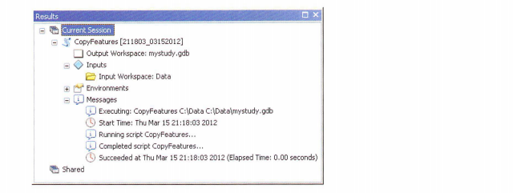

Since this is just the bare bones, th ere are a number of ArcPy functions for writing messages.
These include the following:
* AddMessage - for general information m essages (severity = 0)
* AddWarning - for warning messages (severity = 1)
* AddError - for error messages (severity = 2)
* AddIDMessage - for both warning and e rror messages
* AddReturnMessage - for all messages, independent of severity

The AddReturnMessage function can be used to retrieve all messages returned from a previously run tool, regardless of severity.
The inal severity of the geoprocessing messages is preserved - for example, an error message is printed as an error m essage.
Some of the other m es sage functions crea te a custom message.
For example, the AddError and AddMe s sag e functions are used in the following code to print custom mes sages to the Results window based on the result of a particular tool:


```python
import arcpy
fc = arcpy.GetParameterAsText(0)
result = arcpy.GetCount_management(fc)
fcount = int(result.getOutput(0))
if fcount == 0:
    arcpy.AddError(fc + " has no features.")
else:
    arcpy.AddMessage(fc + " has " + str(fcount) + " features.")
```

In the case of a feature class without any features, running this code wiU
produce an error message, as shown in the figure


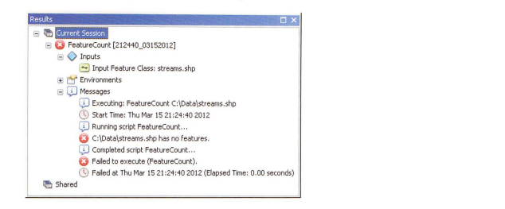

Calling the AddError function also results in a Failed to execute mes sage.
However, it does not add an exception, and the code will keep running after the AddError call When the AddWarning function is us ed instead, it results in a warning message, but the script will finish running.

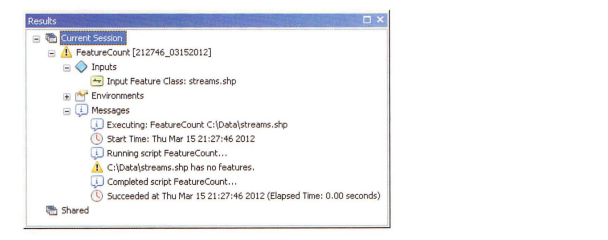

Another level of control can be accomplished using the AddIDMessage function.
This function m akes it possible to use system messages within a tool.
The syntax of the function is
```
AddIDMessage(message_type , message_ID , {add_argument1} , {add_argument2} )
```

The message type can be set to Error, Informative , or Warning.
The message 1D number indicates the specifìc Esri system message.
Depending on the message, additional arguments may be necessary.
The syntax of error message 12 is
```
000012 : <value> already exists
```
This message has one argument, which in this case is the name of a feature class .
A complete list of tool error and warni ng messages can be found in ArcG1S Desktop Help , under Geoprocessing > Tool errors and warnings.
A small sample of these error m essages in Help is shown in the fìgure 1n the following example code, an error message, with the message 1D number 12 , is pro duced if the output feature class already exists


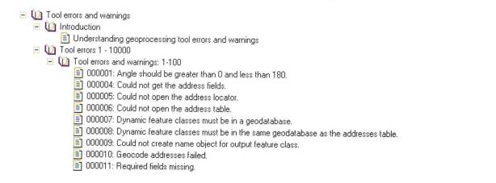

## 13.10 Handling messages for stand-alone scripts and tools

Python scripts can be run as stand-alone scripts or as tools.
Messaging works a bit differently for each one.
However, a script can be designed to handle both scenarios.

For a stand-alone script, there is no way to view messages, and they have to be printed to the interactive interpreter.
For a tool , functions such as AddError are used instead of a print statement to ensure messages appear in the geoprocessing environme including the Results window.

Standard practice is to write a message-handling routine that writes messages to both the interactive interpreter and the geoprocessing environ er using a print statement for the former and ArcPy functions such as AddError, AddWarning , and AddMessage for the latter.


## 13.11 Customizing tool progress information

When a too1 runs, information on its progress can take several forms.
By default, the geoprocessing framework in ArcGIS uses back ground processing.
This means you can continue to use an app lication while the geoprocessing operations run in the background.
During background processing, a progress bar appears at the bottom of the document on the ArcGIS for Desktop app1ica tion status bar, as shown in the figure.
When the geoprocessing operation is completed, a pop-up notification appears in the notification area, at the far ht of the toolbar.


Backgro und processing can be enabled or disabled on the Geoprocessing Options dialog box.
The slider under Background Processing, as shown in the figure, can be moved to control how long the pyp-Up window appears at the end of background processing.


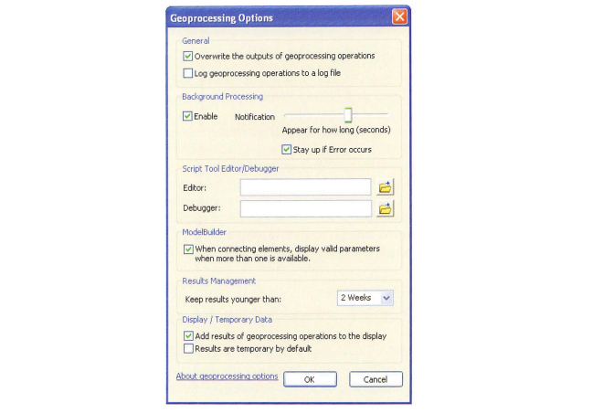

When background processing is disabled, foreground processing is enabled.
During foreground processing, a progress dialog box appears.
A progress dialog box includes a progressor, which consists of a horizontal bar indicating the progress of the tool, and a message area, which consists of a complete list of geoprocessing messages, as shown in the figure.
This is the same list of messages that appears in the Results window.


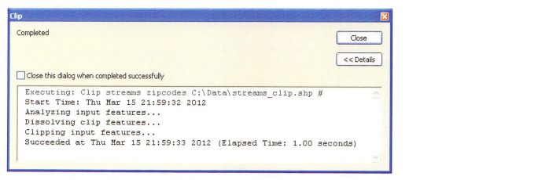

Whether a tool runs as background or foreground processing can be con trolled at the application level using the Geoprocessing Options dialog box.
For a script tool, background or foreground processing can also be con trolled as part of the script tool properties, as described in section 13.3.
The appearance of the progress dialog box, which appears during foreground processing, can be controlled using the ArcPy progressor functions.
These functions also have an effect on the Results window.
The ArcPy progressor functions include the following:

* SetProgressor - sets the type of progressor
* SetProgressorLabel - changes the label of the progressor
* SetProgressorPosition - moves the step progressor by an mcrement
* ResetProgressor - resets the progressor

There are two types of progressors: default and step.
1n the default type, the progressor moves back and forth continuously but doesn't provide a clear indication of how much progress is being m ade.
The label above the progressor provides information on the current geoprocessing operation

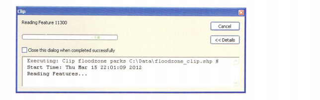


In the step progressor, the percentage completed is shown.
This can be use ful when processing large datasets


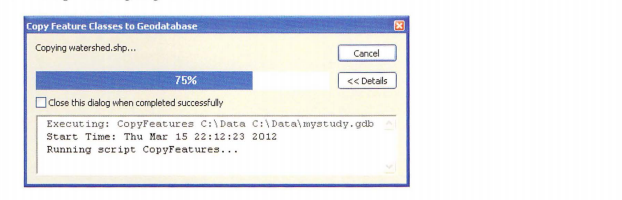

The type of progressor is set using the SetProgressor function.
This function establishes a progressor object, which allows progress informa tion to be passed to a progress dialog box.
The appearance of the progress dialog box can be controlled using either the default progressor or the step progressor.

The syntax of this function is
```
SetProgressor(type, {message}, {min_range}, {max_range}, {step_value} )
```

The progressor type is either default or step.
The message is the progres sor label that appears at the beginning of the tool's execution .
The three remaining parameters are for step progressors only and indicate the start value, the end value, and the step interval.
In a typical step progressor, the start value wo uld be set to 0, the end value to however many steps are com pleted in the geoprocessing operations, and the step interval to 1.

The SetProgressorLabel function is used to update the label of the progressor, which is typically a unique string specific to each step.
The SetProgressorPosition function is used to move the step progressor by an increment based on the percentage of features completed.
These functions are commonly used in combination so that the label is updated at every increment

Once tool execution is completed, th e progressor can be reset to its original position using the ResetProgressor function.

The following Copy Feature Classes to Geodatabase script uses a custom progress dialog box.
A step progressor is used, and the number of steps is derived from the number of feature classes in the list.
In the for loop, the label is changed to the name of the shapenle being copied, and after the shapenle is copied, the step progressor is moved by an increment.
The script is as follows:


```python
import arcpy
import os
from arcpy import env
env.workspace = arcpy.GetParameterAsText(0)
outworkspace = arcpy.GetParameterAsText(1)
fclist = arcpy.ListFeatureClasses()
fcount = len(fclist)
arcpy.SetProgressor("step", "Copying shapefiles to geodatabase", 0, fcount, 1)
for fc in fclist :
    arcpy.SetProgressorLabel("Copying" + fc + "...")
    fcdesc = arcpy.Describe(fc)
    outfc = os.path.join(outworkspace, fcdesc.baseName)
    arcpy.CopyFeatures_management(fc, outfc)
    arcpy.SetProgressorPosition ()
    arcpy.ResetProgressor()
```

Running the script brings up a progress dialog box with a progressor that shows the percentage completed.
This percentage is calculated from the step progressor parameters-that is, the steps are automatically converted to a percentage as they are completed

Another consideration is the number of steps being used in a step progressor.
In many script, it is not known in advance how many feature class, fields, or records will need to be processed.
A script that uses a search cursor, for example, may iterate over millions of records.
If each iteration were one step , the progress dialog box would need to be updated millions of times, which could severely reduce performance.
It may there fore be necessary to include a section in the script that determines the number of iterations (feature classes, rows, or whatever the case may be and then determines an appropriate member of steps based on the nummber of iterations.

## 13.12 Running a script in process

Python scripts can be run in process or out of process.
Running a script in process means that a script can be run as is without ArcGlS having to start another process or program.
Running a script out of process means that ArcGlS has to start another process for the script to run.
When another process is started, it takes time for both programs to run, which reduces performance.
Other performance issues also ar from message communication between the two processes.
In general, therefore, it is recommended that a Python script be run in process so that it will run faster.
Specifying that a tool should run in process or out of process can be done on the Source tab on the tool properties dialog box.
By default, this option is selected-that is, scripts are run in process.
It should be noted that this option applies only to scripts written in Python.


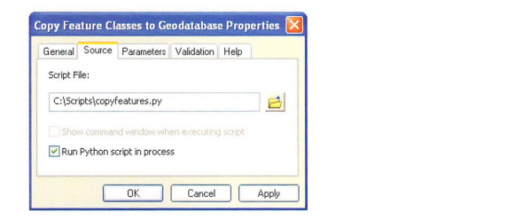

Although running tools in process is recommended to improve performance, there are certain cases when running to0ls in process can cause problems.
For example, some nonstandard modules from third parties may not have the necessary l0gic to run in process.
If you are using third-party modules and are experiencing problems, running the to0l out of process may be the solution.
Standard Python libraries have modules that have the necessary logic and can be run in process without difficulty.

## Points to remember

* Although Python scripts can be run as stand-alone scripts outside of ArcGIS for Desktop applications, there are many benefits to running scripts as tools.
Tools allow a closer integration of scripts in the ArcGIS geoprocessing framework.
For example, tools that reference a script can be used in ModelB uilder the same way as any other tool.


* A tool can be created in any custom toolbox and reference a single Python file (.py) that is called w hen the tool is run.


* For tools to be usable and effective, tool parameters need to be cre ated.
This includes setting parameters in the tool properties, as well as including code in the script to receive the parameter values.
Tool parame ters define what the tool dialog box looks like.


* Effective tools have carefully designed parameters.
Each parameter has a data typ e, such as feature class, table, value, field, or other.
The parameter properties provide detailed control of the allowable inputs for each parameter.
This ensures that the parameters passed from the tool dialog box to the script are as expected


* All tools should have outputs so that the tool can be used in ModelBuilder.
Sometimes the only way to accomplish this is to use derived parameters, which do not appear on the tool dialog box.


* Tool behavior can be further customized using a ToolValidator class.


* Various message functions can be used to write what will appear on the progress dialog box and in the Results window.
The appearance of the progress dialog box can be controlled using a number of different functions to change the progressor.


* Running scripts in process is recommended to improve performance.


```python

```
