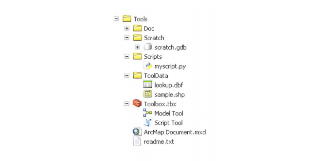
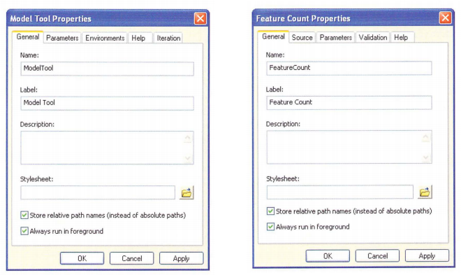

# Chapter 14: Sharing tools

<!-- toc orderedList:0 depthFrom:1 depthTo:6 -->

* [Chapter 14: Sharing tools](#chapter-14-sharing-tools)
  * [14.1 Introduction](#141-introduction)
  * [14.2 Choosing a method for distributing tools](#142-choosing-a-method-for-distributing-tools)
  * [14.3 Handling licensing issues](#143-handling-licensing-issues)
  * [14.4 Using a standard folder structure for sharing tools](#144-using-a-standard-folder-structure-for-sharing-tools)
  * [14.5 Working with paths](#145-working-with-paths)
  * [14.6 Finding data and workspaces](#146-finding-data-and-workspaces)
  * [14.7 Creating a geoprocessing package](#147-creating-a-geoprocessing-package)
  * [14.8 Embedding scripts and password-protecting tools](#148-embedding-scripts-and-password-protecting-tools)
  * [14.9 Documenting tools](#149-documenting-tools)
    * [Providing a brief description](#providing-a-brief-description)
    * [Editing the Description page](#editing-the-description-page)
    * [Using style sheets](#using-style-sheets)
    * [Using a compiled Help file](#using-a-compiled-help-file)
  * [14.10 Example tool: Market analysis](#1410-example-tool-market-analysis)
  * [Points to remember](#points-to-remember)

<!-- tocstop -->


## 14.1 Introduction

The ArcGIS geoprocessing framework is designed to facilitate the sharing of tools.


Custom toolboxes can be added to ArcToolbox and integrated into regular workflows.


Toolboxes can contain any number of tools, consisting of both model tools and script tools.


Tools can therefore be shared by distribut ing a toolbox file (.tbx) that contains the accompanying Python scripts (.py).


However, there are a number of obstacles to sharing script tools.


One of the principal obstacles is that the resources available to the creator of the script will likely be different from those available to the user of the shared script tools.


This includes map documents, toolboxes, scripts, layer files, and any other files used by the tools.


Another obstacle is the organization of these resources on a local computer or ne twork.


Paths present a fairly persistent problem when sharing tools.


This chapter provides guidelines on how to distribute script tools , including how to structure toolboxes, scripts, docu mentation, and other files that are commonly distributed with shared tools.


To help overcome some of these obstacles, ArcGIS 10.1 has introduced geo processing packages as a convenient way to distribute shared tools.


## 14.2 Choosing a method for distributing tools

Tools that are developed to share with others can vary from the simple to the complex.
The simplest case is a single toolbox file w ith one or more tools inside the toolbox and no additional files.
In a more typical example, a shared tool could consist of a toolbox file, one or more scripts that are used in script tools, and some documentation.
A more complex example could contain a toolbox file, several scripts, documentation, compiled Help files, and sample data.
A recommended folder structure for these files is presented later in this chapter.
A relatively typical folder structure might look like the example in the figure.


One of the most common ways to share tools is simply to make all the files available in their original folder structure.
This typically involves the use of a file compression utility to create a single ZIP a le of the foldersand their contents.ThisZIP hle can then be posted onlme or emalled-The reCIDlent can download the ale and extract the contents to access the indl vidJal folders and ales The toolbox is then added to ArcToolbox to access the tools

There are two other ways to share tools.
lf users have access to the same local area network, the folder containing the tools can be copied to a folder that is accessible to all users.
A toolbox can be added directly from the network, and no files need to be copied to the user's computer.
A second alternative is to pub lish the toolbox as a geoprocessm g serVlce usmg ArcGIS for Server, whic h can then be accessed by anyone with an lnternet connection.

The method to use depends largely on the relationship between the creator of the tool and the intended users, as well as the software and the skills of the user.
For example, if tools are developed primarily for use by others w ithin the same organization , making tools available on a local area network may be the most efficient.
To make tools availabl e to a broad com munity of users, the use of a ZIP file is likely the most convenient.

A number of other considerations will influence how to share tools, including where the input and output data is located and w hat products and extensions the tools require .
ln the ZlP file method, for example, any tool data also has to be packaged w ith the tool because a typical user will not have access to any of the data on the network.


## 14.3 Handling licensing issues

Tools dis tributed using the ZIP file method will run on a user's computer, which may not have the necessary products or licenses to run the tools.
Scripts should therefore include logic to check for the necessary product levels (ArcGIS for Desktop Basic, ArcGIS for Desktop Standard, or ArcGlS for Desktop Advanced) and extension licenses (ArcGIS 3D Analyst, ArcGlS Spatial Analyst, and more).
Even if a user has the necessary extensions installed, a license may not have been obtained for the current session.
In this scenario, the tool will stop with an error message.
To facilitate the use of shared tools, the necessary product leveland extensions need to be described in the tool's documentation.
Working with licenses is covered in chapter 5.


## 14.4 Using a standard folder structure for sharing tools

A standard folder structure, like the example in the figure, isrecommended by Esri for easy sharing of geoprocessing tools.
There is norequirement to use this specific structure, but it provides a good starting point.




> __TIP__
Python scripts, by default, are not shown in ArcCatalog, but they can be added as a file type (.py) by going to the menu bar and clicking __Customize > ArcCatalog Options > File Types__.


The Tools folder contains one or more toolboxes (.tbx files), which contain the tools, including model tools and script tools.
Toolboxes can also be placed inside a geodatabase, but a .tbx file directly under the Tools folder is easier to find.

Tools should have the "Store relative path names " check box selected more on paths later in this chapter.
Tool documentation should clearly state w hat product level and extensions arerequired for the tools torun.
ArEADME file (readme.txt) is often included that explains how the tool works and contains special instructions on how the tool needs to be installed, contact information for the tool's creators, and the like.

Distributing an ArcMap document (.mxd) with the tools is optional but may be helpful if example datasets are part of the shared tool.
The ToolData folder may contain sample datasets that a user can work with to learn about the functionality of a tool before trying it out on the user's own data.
The tools may also require certain data as part of tool execution, such as lookup tables, also included in this folder.

The Scripts folder contains the Python scripts used in the script tools Otherrelated files may include script libraries, dynamic-link libraries (DLL), and executable files, such as .exe and .bat (batch) files.
Scripts can also be embedded directly into a toolbox, in whic h case there are no separate script files.
This is not very common, however, since in many cases the purpose of sharing the tools is for users to use and learn from the scripts and contribute to their continued improvement.

Many model tools and script tools use a workspace, and a default &Ie geo database for scratch data (scratch.gdb) can be provided in the Scratch folder

Tool documentation is provided in the Doc folder.
Documentation can consist of a Microsoft Word document (.doc or .docx) or PDF file (.pdf) that provides instructions, external Help compiled HTML files (.chm) that areref erenced by tools 0r toolboxes, and XML style sheets thatreplace the default tool dialog boxes and Help dialog boxes.
Experienced Python coders are likely to ope n the actual scripts and learn from both the comments and the code in the scripts.
Many other users, however, may never look at the scripts and instead use only the tool dialog boxes.
Good documentation wi ll ensure that users get the most out of a tool and understand what it will accomplish, as well as its limitations, without having to open the actual scripts.

## 14.5 Working with paths

Paths are an integral part of working with data and tools.
When tools are shared, paths become particularly important, because without proper docu mentation of where files are located, the tools will not run.

If you have worked with ArcGIS to create map documents or tools, you are probably familiar with absolute and relative paths.
Absolute paths are also referred to as full paths.
They start with a drive letter, followed by a colon (:), and then the folder and file name-for example, C:\Data\streams.shp.
Relative paths refer to a location that is relative to a current folder.
Relative paths make use of special symbols-a single dot (.) and a double dot (..).
A single dot represents the folder yo u are working in, and a double dot represents the parent folder.
Although technically correct, this convention for navigating folders is not very practical because you cannot type relative paths in ArcGIS or Python scripts.
Still, it is important to understand the concept of relative paths and w hat it means in respect to manipulating data in ArcGIS.

Consider the following example with two shape files located in the C:\alldata\shapefiles\final folder: boundary.shp and locations.shp.
Relative to each other, there is no need to know the path other than the base names-that is, the file names.
Now consider an example where you want to run a tool that uses the shape files locations.shp and flood zone.shp.
These files are located in two different folders, and therefore their relative paths are final\locations .shp and project\floodzone.shp.
The higher-level folders-that is, alldata\shape files-are not needed to locate one file relative to the other.


You have likely worked with relative paths when saving map documents (.mxd files).
To avoid lost data connections when folders are moved or renamed, the data source options in map document properties can be set to relative paths.


When map doc uments are saved using relative paths, ArcMap converts absolute paths to relative paths based on the location where the .mxd file is stored.
For example, consider a map document that is saved with relative paths enabled and that is stored as follows:
```
C:\alldata\presentations\Map.mxd
```
If the shape file locations.shp is added to this map document, the absolute path is converted to the following relative path:
```
.\..\shapefiles\final\locations.shp
```

Relative to the location of the map document (Map.mxd) , locations.shp is located in the parent folder of the map document-that is, C:\alldata (hence, the single dot followed by the double dot)-and under the subfolder shape files\final.
The name and location of the parent folder itself is not n eeded to access the shapefile and is therefore not part of the relative path.

> __TIP__
Don't worry too much about the notation for relative paths since you can't type this notation in ArcGIS or Python anyway


The use of relative paths makes it possible to move or rename folders.
For example , if the alldata folder were renamed "data," all paths in the ArcMap document would remain intact.
Similarly, if the drive letter were modified from C to E, all paths would also remain intact.

One limitation of relative paths is that they cannot span multiple disk drives.
If some files are located on the C drive and some on the E drive, only absolute paths will preserve the correct locations of all files.

Similar to working with map documents, absolute paths and relative paths can be used in model tools.
Relative paths for models can be enabled on the model properties dialog box.


In script tools, relative paths are enabled in the Add Script wizard when creating a script tool, or on the script tool properties dialog box for existing tools.




Relative paths are re lative to the current folder where the toolbox file is located.
When relative paths are enabled, it applies to the script files, datasets used for the default value properties, files referenced in the tool docu mentation, layer files used for the symbology properties, compiled Help files, and style sheets.

It is important to re cognize that paths within the script are not converted because ArcG1S has no reliable way to examine and modify the script code.
Therefore, if a script uses absolute paths, they are not converted to relative paths when relative paths are enabled for the script tool.

> __TIP__
In general, Python code needs to be written so that files can be found relative to a known location, which is typically the location of the script itself.

After this review of working wi th paths, it is worthwhile to revisit relative paths in the context of sharing tools.
For the purpose of this discussion, the same example folder structure discussed earlier in this chapter, as shown in the figure, will be used.


To share tools, relative paths have to be enabled in the script tool properties.
1n this example, the script tool will reference a script in the Scripts folder.
It may also reference tool documentation in the Doc folder.
The script itself may reference data in the ToolData folder.
These references will continue to be valid w hen the script tool is shared with another user, as long as the standard folder structure is maintained.
If the toolbox file (Toolbox.tbx) containing the script tool were moved to a different location separate from the other folders and files, the script files called by the script tool would not be found and the script would not work.
The tool dialog box would open, but upon tool execution, the following error message would appear: "Script associated with this tool does not exist."
Therefore, for a script tool to work correctly, the folder structure must be maintained.

## 14.6 Finding data and workspaces

In general, it is best to avoid hard-coding paths into your script if it is going to be shared with others as a script tool.
Instead, the paths are derived from the parameters on the tool dialog box and these paths are passed to the script.
The script reads these parameters using GetParameterAsText and related functions.

Sometimes, however, it is necessary to hard-code paths to a particular location.
For example, an existing layer file may be necessary to set the symbology for an output parameter.
Or a particular tool may require the use of a lookup table.
Depending on the nature of the information, it may already be incorporated into the script (for example, a lookup table can be coded as a Python dictionary ), but this may not always be possible.
Some data files may therefore be necessary for the tool to run , even though they are not provided as parameters for the user.
lnstead, these data files are provided by the author of the script and distributed as part of the shared tool.
Following the suggested folder structure presented earlier in this chap ter, these files wo uld be placed in the ToolData folder, m aking it possible for the data files to be found relative to the location of the script The path of the script can be found using the following code :
```
scriptpath = sys.path()
```
Or:
```
scriptpath = os.getcwd()
```


Running this code results in a string with the complete path of the script, but without the name of the script itself.
If the data files necessary for the script to run are located in the ToolData folder, per the suggested folder structure, the Python module os.
path can be used to create a path to the data.

The folder structure used thus far can serve as an example.
The Tools folder contains the shared Tools, including the Toolbox, the script, and the data files.
Relative paths are enabled for the script Tool, so the Tools folder can be moved, or even renamed, and the script will still work.
The script referenced by the script Tool is located in the Scripts folder.
The script needs a file called lookup.dbf, located in the ToolData folder, to null.
The file name can be hard-coded into the script because the author of the script is also the author of the lookup.dbf file and the creator of the ToolData folder.
However, the absolute path should not be hard-coded into the scri but the relative path used instead: ToolData\lookup.dbf.
This will make it possible for the Tools folder to be moved to any location without the user of the script Tool being limited to the absolute path originally used by the author of the script.
The code that references the lookup.dbf file in the script is as follows:


```python
import arcpy
import os
import sys

scriptpath = sys.path[0]
toolpath = os.path.dirname(scriptpath)
tooldatapath = os.path.join(toolpath, "ToolData")
datapath = os.path.join(tooldatapath, "lookup.dbf")
```


Notice that two elements are hard-coded into the script: the actual file name of the Tool data (lookup .dbf) and the folder where the Tooldata is located (ToolData).
These are both created by the author of the Tooland can there fore be hard-coded into the script be cause they do not depend on user input.

A similar approach can be used to reference the location of a scratch workspace.
Scratch workspaces are very common in models, and they can also be used in scripts.
Using the same example folder structure as before, the script to set the scratch workspace is as follows:


```python
import arcpy
import os
import sys
from arcpy import env

scratchws = env.scratchWorkspace
scriptpath = sys.path[0]
toolpath = os.path.dirname(scriptpath)

if not env.scratchWorkspace:
    scratchws = os.path.join(toolpath, " Scratch/scratch.gdb")
```

When a scratch workspace is set, a few other considerations should be kept in mind, as follows

* Write permission to the workspace is required


* A scratch workspace can be set as part of the environment settings.
If this is the case, a script should use this workspace because it most likely has been intentionally set by the user.
So the preceding example code would typically be preceded by an if statement that evaluates w hether a scratch workspace has been specified in the environment settings that are being passed to the script


* Using the current workspace as a scratch workspace is possible, but it can cause problems.
__First__, the current workspace can become cluttered if the script generates a lot of output.
__Second__, cleaning Up the results afterward can be cumbersom e b ecause it may be difficult to separate interm ediate data, w hich can be deleted, from the final results.
__Third__, if the current workspace is a remote database on a server, it can cause performance issues.


Finally, instead of the name of an (empty) scratch geodatabase being hard coded into a script, the __```CreateScratchName```__
function can be used to create a unique dataset in the scratch workspace.

## 14.7 Creating a geoprocessing package

The approach for distributing shared tools as described so far is quite robust but also somewhat cumbersome.
It typically requires that you manu ally consolidate data, tools, and supporting files into a single folder.
As an alternative, ArcGIS 10.1 has introduced geoprocessing packages, which are a more convenient way to distribute all the tools and files related to geopro cessing workflows.
This section describes w hat a geoprocessing package is and how to create it.

A geoprocessing package is a single compressed file w ith a .gpk exten sion.
This single file contains all the fi les necessary to run a particular geoprocessing workflow, including custom tools, input datasets, and other supporting files.
This file can be posted online, e-mailed, or shared through a local area network.
Although this sounds similar to the use of a ZIP file, as described earlier in this chapter, geoprocessing packages are created very differently and have additional functionality.

A geoprocessing package is created from one or more results in the Results window, which have been created by successfully running one or more geoprocessing tools.
A basic workflow to create and share a geopro cessing package is as follows:

1. Add data (and custom tools if n eeded) to an ArcGIS for Desktop application.
2. Create a geoprocessing workflow by running one or more tools.
3. In the Results window, select one or more results, right click the selection, and click __Share As > Geoprocessing Package__.
4. Complete the entries on the Geoprocessing Package dialog box, which includes options for sharing, for adding additional results or files, and for sharing datasets or only the schema
5. Share the resulting .gpk file.

A recipient of the geoprocessing package can open the contents in an ArcG1S for Desktop application to examine the datasets and workflows used.
A single .gpk file contains all the resources needed to rerun the geoprocessing workflow, including tools, layers, and other files.
Tools can include system tools as well as custom tools.
So, if a geoprocessing result was created using a script tool, this script tool and the underlying .py files necessary for the tool to run would all be included in the geoprocessing package.

The single greatest benefit of using geoprocessing packages is that all the necessary resources are automatically combined in a single file, no matter where they are located.
There is no need to manually consolidate all the reso urces into a single fo1der as required by the more traditional approach using ZIP files

Geoprocessing packages are described in great detail in ArcGIS Desktop
Help on the Contents tab, under __Geoprocessing > Sharing geoprocessing workflows__.


## 14.8 Embedding scripts and password-protecting tools

The most common way to share script tools is to reference the Python script file in the script tool properties and to provide the script file sepa rately, typically in the Scripts folder.
This allows users to clearly see which scripts are being used, and the scripts can be opened to view the code.

__Scripts can also be embedded in a toolbox.__
The code is then contained within the toolbox, and a separate script file is no longer needed.
This approach can make it easier to manage and share tools.

__To import a script, right-click the script tool and click import Script.__
Once a script is imported into a tool, the toolbox can be shared w ithout including the script files.
In other words, just sharing the .tbx file is sufficient, and no separate .py files need to be provided for the script tool to run.
When a script is imported, however, the original script file is not ete it is simply copied and embedded in the toolbox.

__Embedding scripts does not mean they can no longer b e viewed or edited.__
Say, for exampl e, you have imported a script and shared a toolbox w ith another user.
The recipient can right-click the script tool and click Export to obtain a copy of the original script.
Once exported, the script can be viewed and edited the same way as any other script in a shared tool.
Although embedding scripts is a useful way to reduce the number of files to manage and share, it can lead to some confusion.
For example, some script tools use multiple scripts-for example, a script that is referenced by the script tool and additional scripts that are called by the first script.
Embed ding multiple scripts can be confusing to users because it b ecomes less transparent how the scripts work.
In addition, embedding scripts was intro duced in ArcGIS 10, so many users are probably more fa miliar with seeing a .tbx file and one or more .py files than having them embedded.

One very good reason to embed yo ur scripts is to create password protection.
Regular script files cannot be password protected.
If you share yo ur tools including individual .py files, any user can open these scripts w ith a Python editor or a text editor.
Users can modify the code or copy it for use in their own scripts This is, in fact, one of the reasons w hy working with Pytho n is so appealing.
If, for som e reason , yo u need password protection, yo u can right-click the script tool and click Set Password-this wo rks only if you have previously imported a script.


Setting a password does not affect execution of the script tool, but any attempt to view the script or export the script will prompt the use of a password.


## 14.9 Documenting tools

Good documentation is important when sharing tools.
Documentation includes background information on how the tool was developed as well as specifics on how the tool works.
Documentation can also be used to explain specific concepts that may be new to oth er users There are a number of ways to provide documentation for a tool within ArcGIS, as follows :

* A brief, text-only description can be provided on the tool properties dialog box. This description will appear as the default text in the Help panel on the tool dialog box.
* A more detailed description can be created by editing the Description page of a tool. This description is used in multiple locations, includ ing the tool reference page, the Help panel on the tool dialog box, and the H elp panel in the Python window.
* A style sheet can be used, providing additional control of the look and feel of the tool dialog box.
* A compiled Help file can be created and referenced to appear as the tool reference page.

There are other ways to provide documentation as well, within the script itself or on disk, follows:
* By commenting code. Good scripts contain detailed comments, which explain how a script works. Not all users of a script tool may look at the script, but for those who do, comments can b e very informative. Comments are located inside the actual script files.
* Through separate documentation located on disk - for example, in the Doc folder. Docume n tation files can be provided as .doc, .docx, .pdf, or other file types. This documentation typically includes a more detailed explanation of the tools and any relevant background concepts.

Following is a more detailed explanation of some of the ways to provide documentation for a tool.

### Providing a brief description

The simplest form of tool documentation in ArcGIS is accomplished by providing a brief description in the Description box on the tool properties dialog box.
This description can be created in the Add Script wizard or by accessing the script tool properties .


By default, this description will appear in the Help panel on the tool dialog box


This type of tool documentation is a bit limited because it allows for text only, and it provides a description of the tool only, and not individual parameters.
However, it is a good place to start.

### Editing the Description page
By default, when a script tool is created, a Description page is also created, which is populated with the tool's basic syntax.
This page can be viewed in ArcCatalog on the Description tab, where you wou1d normally review metadata For example, the default Description page of the Copy Feature

Classes to Geodatabase script tool created in chapter 13 is shown in the figure.


The default description is rather rudimentary and provides little in addition to what the tool dialog box does.
However, the contents of the Description page can be modified in ArcCatalog by clicking the Edit button under the Description tab, in the same way that metadata can be edited.


From here, you can edit the title and summary, provide examples of the usage, enter detai1s of the syntax in a table, and add code samp1es.
You can also load a thumbnail graphic that illustrates how the tool works.
Tags are used to identify the subject or content of your tool.
The documentation you provide for Item Description is used by the Search window to find your tool.

Notice that there are many entries in the description that are not re1evant to tool usage because they are mostly intended for documenting the metadata for datasets.

Once you modify the Description page, this information is used on the tool dialog box.
For example, if you enter a description for individual parameters, it will appear on the tool dialog box Help panel for that parameter.


The Description page also becomes the default page that loads when the Help option for a particular tool is clicked, unless a different file has been Specified.

### Using style sheets
Style sheets are used to control the proper es of the tool dialog box.
A style sheet provides style and layout information, including fonts, alignment, and margins.
The default style sheet is typically sufficient and is found in the C:\Program Files\ArcGIS\Desktop10.1\ArcToolbox\Stylesheets folder.
The default style sheet is applied automatically for any new tool dialog box, but you can create your own if desired.

### Using a compiled Help file
A script tool can reference a compiled Help file (.chm).
This file is used when viewing the tool Help page.
Compiled Help files are similar to HTML files but are compiled to create a single, self-contained package of documentation.
Compiled Help files are a proprietary format for Help files developed by Microsoft for use in the Windows operating system.
Creating a compiled Help file requires the use of the Microsoft Help Software Development Kit (SDK).

If you have a compiled Help file, you can reference it on the Help tab on the tool properties dialog box.
Optionally, you can provide the Help context by specifying an HTML topic ID.
The Help context controls which topic in the .chm file will be displayed.


If you have already created detailed docu mentation on the tool's Description page, yo u can export this documentation to an HTML file.
This is an option on the H elp tab on the tool properties dialog box.
You can then use this HTML file w hen creating a compiled Help file.

## 14.10 Example tool: Market analysis

This section looks at an example tool to review the organization of the files that are part of the tool, as well as the tool's documentation.
The example tool is a market analysis tool based on the Huff Model, which is used to estimate sales potential for store locations based on demographic data.
The tool was created by Drew Flater as an example of a more advanced script tool and is posted on the ArcGIS for Desktop Resource Center.

The tool's organization closely follows the suggested folder structure.
There is a single .tbx file w ith a single script tool.
The actual script file, HuffModel.py, is located in the Script folder.
The ToolData folder contains a sample dataset as well as some data that th e tool n eeds for execu tion.
The Doc folder contains a .doc or .docx file and a .pdf file that describe the sample data and includes a brief tuto rial on using the tool. ..


Detailed tool documentation can be found on the Description tab in ArcCatalog.
The same documentation can be accessed by view ing the tool's Help file, although the formatting will b e sl ig htly differe nt depending on the HTML browser.
The text and formatting of this documentation is store d in the toolbox.
The image in the documentation is referenced in the tool's description, but the actual image file, help.png, is located in the Doc folder.


The tool dialog box itse lf contains a large number of r eguired and optional parameters.
When the tool dialog box is open, a brief description of the tool a ppears in the Help panel.


The content of the Help panel changes when the cursor is placed inside one of the parameter boxes - in this case, the Store Attractiveness field.
This information is derived from the tool's description.


Separate from ArcGIS, tool documentation is provided in the form of a tutorial file on disk that describes the sample data and expl ains how to run the tool.


Finally, the script itself contains documentation in the form of comments.


This example script is relatively advanced-it has 748 lines of code, and the tool dialog box has 18 parameters.
But the tool's standard organization and documentation make it relatively easy to use.


## Points to remember

* The ArcGIS geoprocessing framework is designed to facilitate the sharing of tools.
Custom toolboxes can be added to ArcToolbox and integrated into regular workflows.
Toolboxes can contain any num ber of tools, consisting of both model tools and script tools.
Tools can therefore be shared by distributing a toolbox file (.tbx) that contains the accompanying Python scripts (.py) and any other resources needed to run the tools.


* To ensure custom tools work properly, the resources needed to run the tools should be made available in a standard folder structure.
This includes folders for scripts, data, and documentation.


* Absolute paths work only when files are not moved and folders are not renamed.
To share tools, relative paths should be enabled for each script tool.
Relative paths are relative to the current folder, which for scripts is where the toolbox is located.
Relative paths can not span multiple drives.


* Geoprocessing packages provide an alternative way to distribute script tools.
A geoprocessing package is a single, compressed file with a .gpk extension that contains all the files necessary to run a particular geoprocessing workflow, including custom tools, input datasets, and other supporting files.


* Shared tools can be documented in various ways, including editing the Description page in ArcCatalog, using style sheets, and referenc ing compiled Help files.


```python

```
