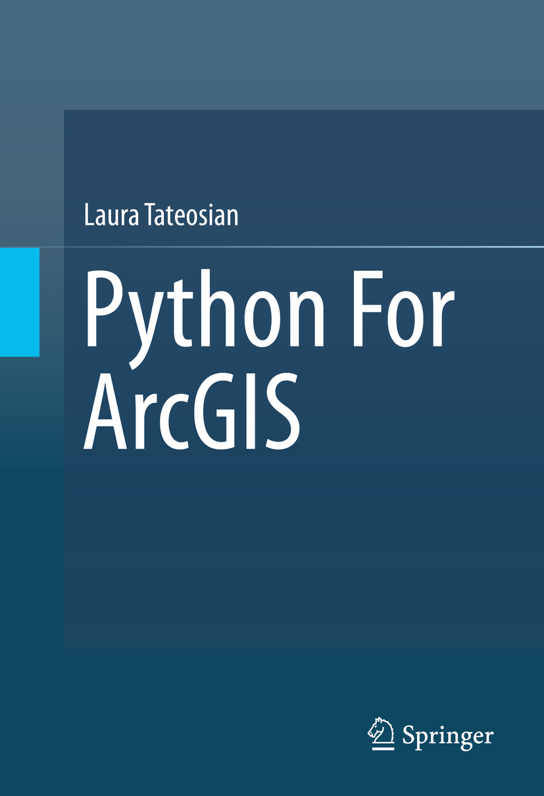

# Python Scripting for ArcGIS

## Info
* Publisher  
  * http://www.springer.com/gp/book/9783319183978?wt_mc=ThirdParty.SpringerLink.3.EPR653.About_eBook)  
  * http://link.springer.com/book/10.1007%2F978-3-319-18398-5  

* [Book Resources]()  

# TOC
* [Chapter 1: Introduction](ch01_Introduction.md)
* [Chapter 2: Beginning Python](ch02_Beginning_Python.md)
* [Chapter 3: Basic Data Types: Numbers and Strings](ch03_Basic_Data_Types_Numbers_and_Strings.md)
* [Chapter 4: Basic Data Types: Lists and Tuples](ch04_Basic_Data_Types_Lists_and_Tuples.md)
* [Chapter 5: ArcGIS and Python](ch05_ArcGIS_and_Python.md)
* [Chapter 6: Calling Tools with Arcpy](ch06_Calling_Tools_with_Arcpy.md)
* [Chapter 7: Getting User Input](ch07_Getting_User_Input.md)
* [Chapter 8: Controlling Flow](ch08_Controlling_Flow.md)
* [Chapter 9: Decision-Making and Describing Data](ch09_Decision_Making_and_Describing_Data.md)
* [Chapter 10: Repetition: Looping for Geoprocessing](ch10_Repetition_Looping_for_Geoprocessing.md)
* [Chapter 11: Batch Geoprocessing](ch11_Batch_Geoprocessing.md)
* [Chapter 12: Additional Looping Functions](ch12_Additional_Looping_Functions.md)
* [Chapter 13: Debugging](ch13_Debugging.md)
* [Chapter 14: Error Handling](ch14_Error_Handling.md)
* [Chapter 15: User-Defined Functions](ch15_User_Defined_Functions.md)
* [Chapter 16: User-Defined Modules](ch16_User_Defined_Modules.md)
* [Chapter 17: Reading and Writing with Cursors](ch17_Reading_and_Writing_with_Cursors.md)
* [Chapter 18: Dictionaries](ch18_Dictionaries.md)
* [Chapter 19: Reading and Writing Text Files](ch19_Reading_and_Writing_Text_Files.md)
* [Chapter 20: Working with HTML and KML](ch20_Working_with_HTML_and_KML.md)
* [Chapter 21: Classes](ch21_Classes.md)
* [Chapter 22: User Interfaces for File and Folder Selection](ch22_User_Interfaces_for_File_and_Folder_Selection.md)
* [Chapter 23: ArcGIS Python GUIs](ch23_ArcGIS_Python_GUIs.md)
* [Chapter 24: Mapping Module](ch24_Mapping_Module.md)
